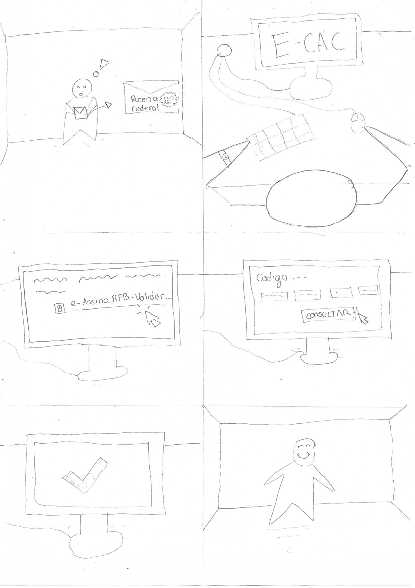

# Storyboards

## Tabela de contribuição

| Autor | Análises realizadas | Data |
|---|---|---|
| [João Morais](https://github.com/Blazemorales) | Criação do Documento, [storyboard 1](#11-storyboard-1) e [storyboard 2](#12-storyboard-2) | 28/05/2026 |
| [Rafael Melatti](https://github.com/Romm-0) | Criação do [storyboard 3](#13-storyboard-3) | 28/05/2026 |
|[Heyttor Augusto](https://github.com/H3ytt0r62) |Adição dos storyboards [análise storyboard 4](#hta-4) e [Análise storyboard 5](#hta-5) | 28/05/2026 |
| [Lucas Gabriel](https://github.com/lucaszg-g) | Adição do [storyboard 6](#16-storyboard-6) | 30/05/2026 |

## 1. Storyboards

---

### 1.1 Storyboard 1
- Tarefa: alteração de dados bancários para restituição do Imposto de Renda

Autor: [João Pedro](https://github.com/Blazemorales)

---

### 1.2 Storyboard 2
- Extrato do processamento do DIRF

Autor: [João Pedro](https://github.com/Blazemorales)

---

### 1.3 Storyboard 3
- Leilão da Receita Federal

Autor: [Rafael Melatti](https://github.com/Romm-0)

---

### 1.4 Storyboard 4
- Tarefa: Agendamento presencial 

Autor: [Heyttor Augusto](https://github.com/H3ytt0r62)

---

### 1.5 Storyboard 5
- Tarefa: Compração de CPF

Autor: [Heyttor Augusto](https://github.com/H3ytt0r62)

---

### 1.6 Storyboard 6
- Tarefa: e-AssinaRFB-Validar, Adicionar e Assinar Documentos Digitais

Autor: [Lucas Gabriel](https://github.com/lucaszg-g)

---

## 2. Agradecimentos

<!-- Agradecemos à IA generativa [Claude](https://claude.ai/new) by Antrophic, que nos ajudou a corrigir erros nas análises de tarefas (lógica incompleta no GOMS), e junto com o [ChatGPT](https://chatgpt.com/), converter as tabelas em formato suportado para markdown (.MD) -->

## 3. Referência Bibliográfica

## Versionamento 

| Versão | Data | Descrição | Autor(es/as) | Revisor(es/as) |
| :--- | :--- | :--- | :--- | :--- |
| 1.0 | 28/05/2026 | Iniciação do documento | [João Morais](https://github.com/Blazemorales) | [Heyttor Augusto](https://github.com/H3ytt0r62)|
| 1.1 | 28/05/2026 | Restruturação do documento, correções e adição do [storyboard 3](#13-storyboard-3) | [Rafael Melatti](https://github.com/Romm-0) | - |
| 1.2 | 29/05/2026 | adição dos storyboards |[Heyttor Augusto](https://github.com/H3ytt0r62) | [Rafael Melatti](https://github.com/Romm-0) |
| 1.3 | 30/05/2026 | Padronização | [Rafael Melatti](https://github.com/Romm-0) | [Lucas Gabriel](https://github.com/lucaszg-g) |
| 1.4 | 30/05/2026 | Adição do [storyboard 6](#16-storyboard-6) | [Lucas Gabriel](https://github.com/lucaszg-g) | - |

