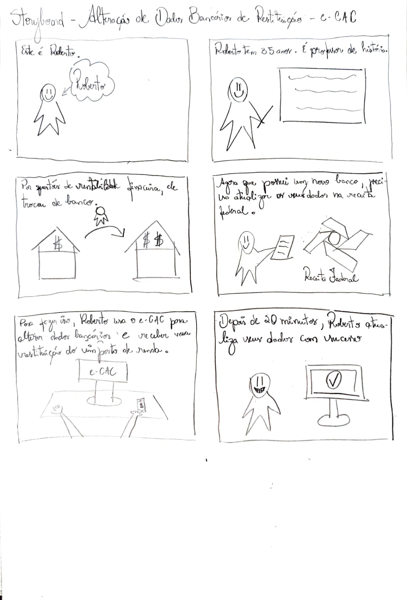
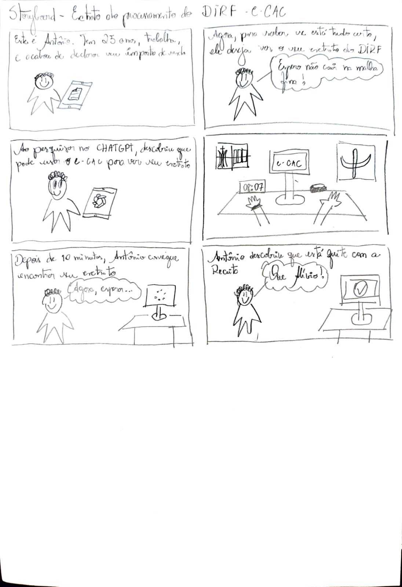
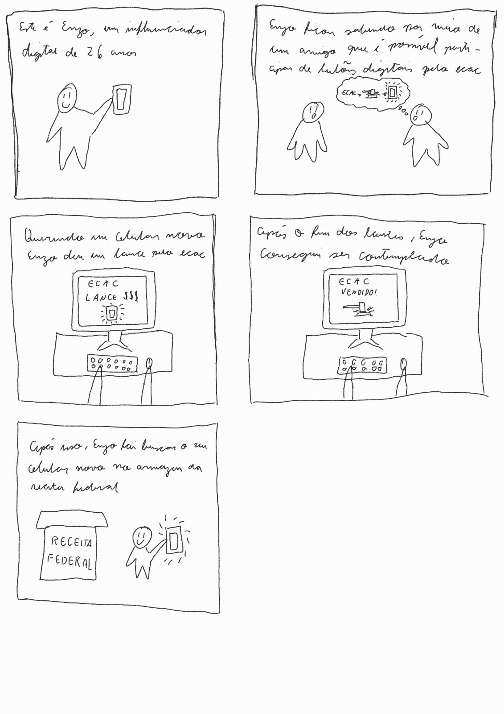

# Storyboards

## Tabela de contribuição

| Autor | Análises realizadas | Data |
|---|---|---|
| [João Morais](https://github.com/Blazemorales) | Criação do Documento, [storyboard 1](#11-storyboard-1) e [storyboard 2](#12-storyboard-2) | 28/05/2026 |
| [Rafael Melatti](https://github.com/Romm-0) | Criação do [storyboard 3](#13-storyboard-3) | 28/05/2026 |

## 1. Storyboards

---

### 1.1 Storyboard 1

- Produzido por: [João Pedro](https://github.com/Blazemorales)
- Tarefa: alteração de dados bancários para restituição do Imposto de Renda

---

### 1.2 Storyboard 2
- Produzido por [João Pedro](https://github.com/Blazemorales)
- Extrato do processamento do DIRF

---

### 1.3 Storyboard 3
- Produzido por [Rafael Melatti](https://github.com/Romm-0)
- Leilão da Receita Federal

---

## 2. Agradecimentos

<!-- Agradecemos à IA generativa [Claude](https://claude.ai/new) by Antrophic, que nos ajudou a corrigir erros nas análises de tarefas (lógica incompleta no GOMS), e junto com o [ChatGPT](https://chatgpt.com/), converter as tabelas em formato suportado para markdown (.MD) -->

## 3. Referência Bibliográfica

## Versionamento 

| Versão | Data | Descrição | Autor(es/as) | Revisor(es/as) |
| :--- | :--- | :--- | :--- | :--- |
| 1.0 | 28/05/2026 | Iniciação do documento | [João Morais](https://github.com/Blazemorales) | [Heyttor Augusto](https://github.com/H3ytt0r62)|
| 1.1 | 28/05/2026 | Restruturação do documento, correções e adição do [storyboard 3](#13-storyboard-3) | [Rafael Melatti](https://github.com/Romm-0) | - |

