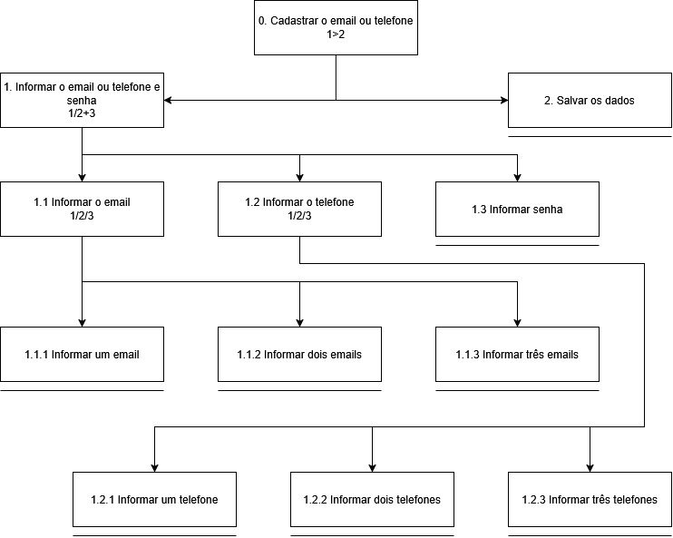
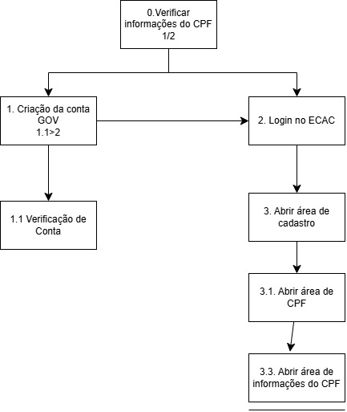
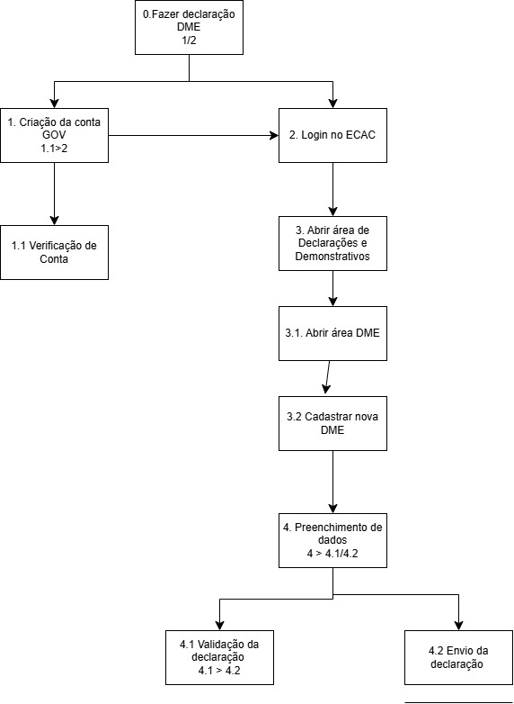
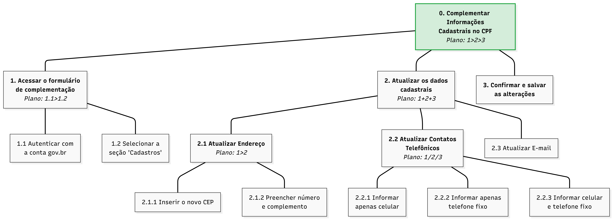

# Análise de Tarefas

## Tabela de contribuição

| Autor | Análises realizadas | Data |
|---|---|---|
| [João Morais](https://github.com/Blazemorales) | Criação do Documento, [análise GOMS 1](#11-analise-goms-alteracao-de-dados-bancarios-para-restituicao-do-imposto-de-renda) e [análise GOMS 2](#12-analise-goms-extrato-do-processamento-do-dirf) | 27/05/2026 |
| [Thiago Gomes](https://github.com/thgomxs) | Inclusão da [análise HTA 1](#21-analise-hta-emissao-de-darf) e [análise HTA 2](#22-analise-hta-emissao-de-certidao-negativa-de-debitos-cnd) | 28/05/2026 |
| [Rafael Melatti](https://github.com/Romm-0) | Inclusão da [análise HTA 3](#23-analise-hta-cadastro-na-caixa-postal-da-receita-federal) | 28/05/2026 |
| [Rafael Melatti](https://github.com/Romm-0) | Inclusão da [análise GOMS 3](#13-analise-goms-dar-um-lance-em-um-leilao-da-receita-federal) | 31/05/2026 |
| [Heyttor Augusto](https://github.com/H3ytt0r62) |Adição das tarefas [análise HTA 4](#24-analise-hta-busca-de-informacoes-do-cpf) e [Análise HTA 5](#25-analise-hta-declaracao-dme) | 29/05/2026 |
| [Lucas Gabriel](https://github.com/lucaszg-g) | Adição da [análise HTA 6](#26-complementação-de-informações-cadastrais-no-cpf) | 30/05/2026 |

---

## 1. Análise pelo método G.O.M.S

---

### 1.1 Análise GOMS - Alteração de dados bancários para restituição do Imposto de Renda

**Ação Desejada Pelo Usuário**: Alteração de dados bancários para restituição do Imposto de Renda

**Pré-condição**: Usuário possui conta Gov.br com nível prata ou ouro, acesso à internet e conhecimento de navegadores de internet (busca por páginas). Ponto de partida: página inicial do e-CAC (`cav.receita.fazenda.gov.br`), usuário ainda não autenticado.

**G.O.M.S**

```
GOAL 0: Extrato do processamento do DIRF

  GOAL 1: Autenticar-se no e-CAC
    SEL. RULE: SE possui senha Gov.br → METHOD 1
               SE possui conta em banco conveniado → METHOD 2
               SE possui certificado digital instalado → METHOD 3
               SE possui certificado digital em nuvem →  METHOD 4

    METHOD 1: Login com CPF e senha Gov.br
      OP 1.1: Acessar o portal e-CAC no navegador
      OP 1.2: Clicar em "Entrar com Gov.br"
      OP 1.3: Digitar CPF e clicar em "Continuar"
      OP 1.4: Digitar a senha da conta Gov.br
      OP 1.5: Confirmar autenticação de 2 fatores (código pelo aplicativo Gov.br ou biometria)
      OP 1.6: Aguardar redirecionamento para o painel do e-CAC

    METHOD 2: Login pelo Internet Banking (banco conveniado)
      OP 2.1: Acessar o portal e-CAC no navegador
      OP 2.2: Clicar em "Entrar com Gov.br"
      OP 2.3: Digitar CPF e clicar em "Continuar"
      OP 2.4: Selecionar a opção "Entrar com seu banco"
      OP 2.5: Escolher o banco conveniado na lista exibida
      OP 2.6: Autenticar-se no ambiente do banco (agência, conta, senha ou token)
      OP 2.7: Aguardar redirecionamento para o painel do e-CAC

    METHOD 3: Login com Certificado Digital instalado
      OP 3.1: Acessar o portal e-CAC no navegador
      OP 3.2: Clicar em "Entrar com Gov.br"
      OP 3.3: Digitar CPF e clicar em "Continuar"
      OP 3.4: Selecionar a opção "Certificado Digital"
      OP 3.5: Selecionar o certificado instalado na máquina ou token USB
      OP 3.6: Digitar o PIN do certificado, se solicitado
      OP 3.7: Aguardar redirecionamento para o painel do e-CAC

    METHOD 4: Login com Certificado Digital em nuvem
      OP 4.1: Acessar o portal e-CAC no navegador
      OP 4.2: Clicar em "Entrar com Gov.br"
      OP 4.3: Digitar CPF e clicar em "Continuar"
      OP 4.4: Selecionar a opção "Certificado Digital em Nuvem"
      OP 4.5: Escolher o provedor de nuvem (ex: Soluti, Serpro, Certisign)
      OP 4.6: Autenticar-se no provedor (senha ou biometria pelo app)
      OP 4.7: Aguardar redirecionamento para o painel do e-CAC

  GOAL 2: Localizar a função "Alteração de Dados Bancários p/ Restituição do Imposto de Renda"
    SEL. RULE: SE o usuário conhece o menu → usar METHOD 1
               SE não conhece o caminho → usar METHOD 2

    METHOD 1: Navegação pelo menu lateral
      OP 1.1: Identificar o grupo "Restituição e Compensação" no menu
      OP 1.2: Clicar em "Restituição, Compensação, Parcelamento e Dívida"
      OP 1.3: Clicar em "Alterar Dados Bancários p/ Restituição do Imposto de Renda"

    METHOD 2: Busca pelo serviço via campo de pesquisa
      OP 2.1: Clicar em "Localizar Serviço" (campo de busca no topo)
      OP 2.2: Digitar "Alteração de Dados Bancários Restituição"
      OP 2.3: Verificar os resultados exibidos
      OP 2.4: Clicar no resultado correspondente ao serviço desejado

  GOAL 3: Preencher e confirmar os novos dados bancários
    METHOD 1: Edição direta no formulário exibido
      OP 1.1: Verificar os dados bancários atuais exibidos na tela
      OP 1.2: Selecionar o banco desejado na lista suspensa (campo "Banco")
      OP 1.3: Digitar o número da agência (sem dígito verificador)
      OP 1.4: Selecionar o tipo de conta: Corrente ou Poupança
      OP 1.5: Digitar o número da conta com dígito verificador
      OP 1.6: Confirmar que a conta está no CPF do contribuinte (verificação visual)
      OP 1.7: Clicar em "Gravar" ou "Confirmar"
      OP 1.8: Verificar a mensagem de confirmação de sucesso exibida pelo sistema
```
Autor: [João Pedro](https://github.com/Blazemorales)

---

### 1.2 Análise GOMS - Extrato do processamento do DIRF

**Ação Desejada Pelo Usuário**: Extrato do processamento do DIRF

**Pré-condição**: Usuário possui conta Gov.br com nível prata ou ouro, acesso à internet e conhecimento de navegadores de internet (busca por páginas). Ponto de partida: página inicial do e-CAC (`cav.receita.fazenda.gov.br`), usuário ainda não autenticado.

**G.O.M.S**

```
# Alterar dados bancários para restituição do Imposto de Renda

## GOAL 1 — Autenticar-se no e-CAC

**Regra de seleção:**
- Possui senha Gov.br → Método 1
- Possui conta em banco conveniado → Método 2
- Possui certificado digital instalado → Método 3
- Possui certificado digital em nuvem → Método 4

### Método 1 — Login com CPF e senha Gov.br

1. Acessar o portal e-CAC no navegador
2. Clicar em "Entrar com Gov.br"
3. Digitar CPF e clicar em "Continuar"
4. Digitar a senha da conta Gov.br
5. Confirmar autenticação de 2 fatores (código pelo aplicativo Gov.br ou biometria)
6. Aguardar redirecionamento para o painel do e-CAC

### Método 2 — Login pelo Internet Banking (banco conveniado)

1. Acessar o portal e-CAC no navegador
2. Clicar em "Entrar com Gov.br"
3. Digitar CPF e clicar em "Continuar"
4. Selecionar a opção "Entrar com seu banco"
5. Escolher o banco conveniado na lista exibida
6. Autenticar-se no ambiente do banco (agência, conta, senha ou token)
7. Aguardar redirecionamento para o painel do e-CAC

### Método 3 — Login com Certificado Digital instalado

1. Acessar o portal e-CAC no navegador
2. Clicar em "Entrar com Gov.br"
3. Digitar CPF e clicar em "Continuar"
4. Selecionar a opção "Certificado Digital"
5. Selecionar o certificado instalado na máquina ou token USB
6. Digitar o PIN do certificado, se solicitado
7. Aguardar redirecionamento para o painel do e-CAC

### Método 4 — Login com Certificado Digital em nuvem

1. Acessar o portal e-CAC no navegador
2. Clicar em "Entrar com Gov.br"
3. Digitar CPF e clicar em "Continuar"
4. Selecionar a opção "Certificado Digital em Nuvem"
5. Escolher o provedor de nuvem (ex: Soluti, Serpro, Certisign)
6. Autenticar-se no provedor (senha ou biometria pelo app)
7. Aguardar redirecionamento para o painel do e-CAC

---

## GOAL 2 — Localizar a função "Extrato de Processamento do DIRF"

**Regra de seleção:**
- Conhece o menu → Método 1
- Não conhece o caminho → Método 2

### Método 1 — Navegação pelo menu lateral

1. Identificar o grupo "Declarações e Demonstrativos" no menu
2. Clicar em "Declarações e Demonstrativos"
3. Identificar "DIRF - Declaração do Imposto de Renda Retido na Fonte"
4. Clicar em "Extrato do processamento da DIRF"

### Método 2 — Busca pelo serviço via campo de pesquisa

1. Clicar em "Localizar Serviço" (campo de busca no topo)
2. Digitar "Extrato do processamento da DIRF"
3. Verificar os resultados exibidos
4. Clicar no resultado correspondente ao serviço desejado

---

## GOAL 3 — Preencher e confirmar os novos dados bancários

### Método 1 — Edição direta no formulário exibido

1. Verificar os dados bancários atuais exibidos na tela
2. Selecionar o banco desejado na lista suspensa (campo "Banco")
3. Digitar o número da agência (sem dígito verificador)
4. Selecionar o tipo de conta: Corrente ou Poupança
5. Digitar o número da conta com dígito verificador
6. Confirmar que a conta está no CPF do contribuinte (verificação visual)
7. Clicar em "Gravar" ou "Confirmar"
8. Verificar a mensagem de confirmação de sucesso exibida pelo sistema

---
```
Autor: [João Pedro](https://github.com/Blazemorales)

---

### 1.3 Análise GOMS - Dar um lance em um leilão da Receita Federal

**Ação Desejada Pelo Usuário**: Fazer um lance em um produto de interesse do usuário por meio do leilão da Receita Federal

**Pré-condição**: Usuário possui conta Gov.br com nível prata ou ouro, acesso à internet e conhecimento de navegadores de internet (busca por páginas). Ponto de partida: página inicial do e-CAC (`cav.receita.fazenda.gov.br`), usuário já autenticado.

**Modelo utilizado**: CMN-GOMS no formato detalhado

**G.O.M.S**
```
# Dar um lance em um leilão da Receita Federal (RF)

GOAL 0: Enviar o lance em um produto do leilão digital da RF

  GOAL 1: Ir para a página do leilão digital

    METHOD 1: Utilizando o botão
      OP 1.1: Deslocar o cursor até o botão "outros"
      OP 1.2: Clicar no botão "outros" do menu
      OP 1.3: Deslocar o cursor até o botão "Participar do leilão eletrônico digital da receita federal"
    METHOD 2: Utilizando a barra de pesquisa
      OP 2.1: Deslocar o cursor até a barra de pesquisa e clicar em cima dela
      OP 2.2: Digitar qualquer palavra dessa frase "Participar do leilão eletrônico digital da receita federal"
      OP 2.3: Selecionar a opção escrita "Participar do leilão eletrônico digital da receita federal"
  
  GOAL 2: Dar o lance no produto
  (SEL. RULE: o produto será o primeiro da aba dos leilões, estará no horário de dar os lances)
    METHOD 1: Utilizado o botão
      OP 1.1: Deslocar o cursor até o botão "incluir proposta"
      OP 1.2: Deslocar e clicar no checkbox de "Li e aceito todas as declarações acima"
      OP 1.3: Deslocar e clicar no botão "Aceitar"
      OP 1.4: Deslocar e clicar no botão "ok"
      OP 1.5: Digitar um valor acima do valor mínimo para dar o lance
      OP 1.6: Deslocar e clicar no botão "Salvar"
      OP 1.7: Deslocar e clicar no botão "Enviar"

```

## 2. Análise pelo método HTA

### 2.1 Análise HTA - Emissão de DARF

| Objetivos e operações | Elementos da HTA, Problemas e Recomendações |
| :--- | :--- |
| **0. Emitir DARF da cota atual** | **plano:** 1>2>3>4>5 — fazer login no e-CAC, navegar até pagamentos, consultar comprovantes, selecionar e gerar o DARF, baixar o PDF. |
| 1. Acessar o e-CAC e fazer login | **plano:** 1.1 / 1.2 |
| 1.1 Criar ou recuperar conta gov.br (caso não possua) | **ação:** Realizar o processo de cadastro ou recuperação de credenciais na plataforma. <br> **feedback:** Conta ativa e pronta para uso. |
| 1.2 Inserir credenciais e autenticar | **input:** Tela de login gov.br carregada. <br> **ação:** Digitar o CPF e a senha e clicar para confirmar. <br> **feedback:** Acesso concedido e direcionamento à tela inicial do e-CAC. |
| 2. Acessar aba de pagamentos | **plano:** 2.1 |
| 2.1 Clicar em "Pagamentos e Parcelamentos" | **input:** Tela inicial do e-CAC visível. <br> **ação:** Clicar na aba correspondente no menu lateral. <br> **feedback:** Expansão das opções de pagamento. |
| 3. Consultar comprovantes | **plano:** 3.1 |
| 3.1 Clicar em "Consulta Comprovante de Pagamento - DARF" | **input:** Opções de pagamento expandidas. <br> **ação:** Clicar no link de consulta de comprovantes. <br> **feedback:** Lista de cotas carregada na tela. |
| 4. Selecionar e emitir DARF | **plano:** 4.1>4.2 <br> **problema:** O sistema pode demorar a carregar a lista de cotas. <br> **recomendação:** Exibir um indicador visual de progresso (loading) e aguardar o carregamento completo antes de permitir a interação. |
| 4.1 Selecionar cota em aberto do mês atual | **input:** Lista de cotas disponíveis. <br> **ação:** Clicar na cota com o vencimento correspondente. <br> **feedback:** Cota destacada/selecionada visualmente. |
| 4.2 Clicar em "Emitir DARF" | **input:** Cota selecionada. <br> **ação:** Clicar no botão "Emitir DARF". <br> **problema:** Lentidão na geração do arquivo. <br> **feedback:** Documento PDF gerado e exibido na tela. |
| 5. Baixar PDF | **plano:** 5.1 |
| 5.1 Salvar o arquivo localmente | **input:** Documento PDF visível na tela. <br> **ação:** Clicar no botão/ícone de download. <br> **feedback:** Arquivo salvo no dispositivo local do usuário. |

Autor: [Thiago Gomes](https://github.com/thgomxs)

---

### 2.2 Análise HTA - Emissão de Certidão Negativa de Débitos (CND)

| Objetivos e operações | Elementos da HTA, Problemas e Recomendações |
| :--- | :--- |
| **0. Emitir Certidão Negativa de Débitos (CND)** | **plano:** 1>2>3>4 — fazer login, acessar a seção de certidões, solicitar o documento e realizar o download. |
| 1. Acessar o e-CAC e fazer login | **plano:** 1.1 / 1.2 |
| 1.1 Criar ou recuperar conta gov.br (caso não possua) | **ação:** Realizar o processo de cadastro ou recuperação de credenciais. <br> **feedback:** Conta ativa e pronta para uso. |
| 1.2 Inserir credenciais e autenticar | **input:** Tela de login gov.br. <br> **ação:** Inserir credenciais (CPF/Senha) e confirmar o login. <br> **feedback:** Usuário autenticado e redirecionado para a tela inicial (Meu Painel). |
| 2. Acessar aba de certidões | **plano:** 2.1 |
| 2.1 Clicar em "Certidões e Situação Fiscal" | **input:** Tela inicial do e-CAC carregada. <br> **ação:** Clicar na aba "Certidões e Situação Fiscal" no menu principal. <br> **feedback:** Carregamento das opções de certidões disponíveis. |
| 3. Consultar e solicitar CND | **plano:** 3.1>3.2 <br> **problema:** Se houver pendências ativas (débitos), o sistema simplesmente bloqueia a emissão da CND com uma mensagem genérica, deixando o usuário sem saber o que fazer. <br> **recomendação:** Exibir uma mensagem de erro clara especificando qual é a pendência impeditiva e fornecer um botão de atalho/link direto para a aba de emissão de DARF ou regularização da dívida. |
| 3.1 Acessar a emissão de certidão | **input:** Menu de certidões disponível. <br> **ação:** Clicar em "Consulta Pendências - Situação Fiscal" ou "Emitir Certidão". <br> **feedback:** Tela de emissão carregada. |
| 3.2 Solicitar o documento | **input:** Tela de emissão visível. <br> **ação:** Clicar no botão para gerar a certidão. <br> **feedback:** Sistema processa a solicitação e exibe a certidão na tela. |
| 4. Baixar PDF da Certidão | **plano:** 4.1 |
| 4.1 Salvar o documento no dispositivo | **input:** Certidão gerada e exibida. <br> **ação:** Clicar no ícone de download ou de impressão. <br> **feedback:** O arquivo PDF da certidão é salvo no dispositivo do usuário. |

Autor: [Thiago Gomes](https://github.com/thgomxs)

---

### 2.3 Análise HTA Cadastro na Caixa Postal da Receita Federal



| Objetivos e operações | Elementos da HTA, Problemas e Recomendações |
| :--- | :--- |
| **0. Cadastrar o email ou telefone** | **plano:** 1>2 — informar os dados e salvar. |
| 1. Informar o email ou telefone e senha | **plano:** 1/2+3 — preencher email ou telefone (ao menos um) e, obrigatoriamente, a senha. <br> **problema:** Todos os campos de celular e email são exibidos simultaneamente, podendo deixar o usuário confuso e faze-lo pensar que deve preencher todos os campos <br> **recomendação:** Colocar uma explicação no topo da página explicando deve ser preenchido |
| 1.1 Informar o email | **plano:** 1/2/3 — o usuário pode cadastrar um, dois ou três emails. |
| 1.1.1 Informar um email | **input:** Três campos de email exibidos simultaneamente na tela de cadastro. <br> **ação:** Digitar um endereço de email válido no primeiro campo. <br> **feedback:** Campo preenchido. <br> **problema:** Não há validação em tempo real do formato do email enquanto o usuário digita, podendo gerar erros apenas ao tentar salvar. <br> **recomendação:** Implementar validação inline que indique imediatamente se o formato do email é inválido, antes da submissão do formulário. |
| 1.1.2 Informar dois emails | **input:** Segundo campo de email disponível na mesma tela. <br> **ação:** Digitar um segundo endereço de email válido. <br> **feedback:** Dois campos preenchidos. |
| 1.1.3 Informar três emails | **input:** Terceiro campo de email disponível na mesma tela. <br> **ação:** Digitar um terceiro endereço de email válido. <br> **feedback:** Três campos preenchidos. |
| 1.2 Informar o telefone | **plano:** 1/2/3 — o usuário pode cadastrar um, dois ou três números de celular. |
| 1.2.1 Informar um telefone | **input:** Três campos "DDD + número de celular" exibidos simultaneamente na tela de cadastro. <br> **ação:** Digitar o DDD e o número de celular no primeiro campo. <br> **feedback:** Campo preenchido com indicação visual do formato (DDD) numero. |
| 1.2.2 Informar dois telefones | **input:** Segundo campo de celular disponível na mesma tela. <br> **ação:** Digitar o DDD e o número de celular no segundo campo. <br> **feedback:** Dois campos preenchidos. |
| 1.2.3 Informar três telefones | **input:** Terceiro campo de celular disponível na mesma tela. <br> **ação:** Digitar o DDD e o número de celular no terceiro campo. <br> **feedback:** Três campos preenchidos. |
| 1.3 Informar senha | **input:** Campo "Código de segurança" disponível na tela de cadastro, com descrição dos requisitos logo abaixo. <br> **ação:** Digitar um código de segurança entre 2 e 20 caracteres (letras ou números, separados ou não por espaço). <br> **feedback:** Campo preenchido. |
| **2. Salvar os dados** | **input:** Formulário com ao menos um campo de email ou celular preenchido, além do código de segurança. <br> **ação:** Clicar no botão "Salvar" no canto inferior direito da tela. <br> **feedback:** Sistema confirma o cadastro com mensagem de sucesso e registra as informações. <br> **problema:** Como não há sinalização de obrigatoriedade nos campos de email e celular, o usuário pode tentar salvar sem preencher nenhum dos dois, descobrindo a restrição apenas após a tentativa de submissão. <br> **recomendação:** Exibir mensagem de erro inline imediatamente abaixo das seções de celular e email após preencher o campo da senha, indicando que ao menos um dos dois deve ser preenchido antes de salvar. |

Autor: [Rafael Melatti](https://github.com/Romm-0)

---

### 2.4 Análise HTA busca de informações do CPF



| Objetivos e operações | Elementos da HTA, Problemas e Recomendações |
| :--- | :--- |
| **0. Verificar informações do CPF** | **plano:** 1/2 — fazer o processo de login ou cadastro |
| **1. Criação de conta** | **plano:** 1.1 > 2 — So pode fazer o login após a crianção da conta |
| 1.1 Verificação de conta | **plano:** o usuário deve verificar sua conta para seguir o processo |
| **2. Login no E-cac** | **input:** Colocar as informações de login.  |
| **3. Abrir area de cadastro** | **ação:** Mover o mouse ate o botão de cadastro e clicar com o botão esquerdo  |
| **3.1 Abrir area de CPF** | **ação:** Mover o mouse ate o botão de CPF e clicar com o botão esquerdo  |
| **3.2 Abrir area de Informações de CPF** | **ação:** Mover o mouse ate o botão da opção e clicar com o botão esquerdo  |

Autor: [Heyttor Augusto](https://github.com/H3ytt0r62)

---

### 2.5 Análise HTA Declaração DME



| Objetivos e operações | Elementos da HTA, Problemas e Recomendações |
| :--- | :--- |
| **0. Fzer declaração DME** | **plano:** 1/2 — fazer o processo de login ou cadastro |
| **1. Criação de conta** | **plano:** 1.1 > 2 — So pode fazer o login após a crianção da conta |
| 1.1 Verificação de conta | **plano:** o usuário deve verificar sua conta para seguir o processo |
| **2. Login no E-cac** | **input:** Colocar as informações de login.  |
| **3. Abrir area de declarações e demonstrativos** | **ação:** Mover o mouse ate o botão de cadastro e clicar com o botão esquerdo  |
| **3.1 Abrir area de DME** | **ação:** Mover o mouse ate o botão de DME e clicar com o botão esquerdo  |
| **4 Preenchimento de dados** | **Plano** 4>4.1/4.2 - Ou verifica os dados ou ja envia diretamente **ação:** Mover o mouse ate o botão da opção e clicar com o botão esquerdo, **input** Digitar os dados no DME |
|**4.1 Validação de declaração** | **input** Clicar em validação |
|**4.2 Envio de declaração** | **input** Clicar em enviar

Autor: [Heyttor Augusto](https://github.com/H3ytt0r62)

---

### 2.6 Complementação de Informações Cadastrais no CPF



| Objetivos e operações | Elementos da HTA, Problemas e Recomendações |
| :--- | :--- |
| **0. Complementar Informações Cadastrais no CPF** | **plano:** 1>2>3 — acessar o sistema, atualizar os dados desejados e salvar as alterações. |
| **1. Acessar o formulário de complementação** | **plano:** 1.1>1.2 — realizar o login e encontrar a seção correta.<br><br>**problema:** A navegação interna do e-CAC é baseada em um menu lateral com muitos itens de texto sem hierarquia visual clara, dificultando a localização rápida da funcionalidade.<br><br>**recomendação:** Incluir uma barra de pesquisa global em destaque e utilizar ícones para facilitar o escaneamento visual das categorias principais no painel. |
| **1.1 Autenticar com a conta gov.br** | **input:** Tela de login única do governo federal.<br><br>**ação:** Inserir CPF, senha e concluir autenticação em dois fatores (se exigido).<br><br>**feedback:** Redirecionamento para a página inicial logada do portal e-CAC. |
| **1.2 Selecionar a seção 'Cadastros'** | **input:** Página inicial do e-CAC com menus de navegação.<br><br>**ação:** Clicar em "Cadastros" e depois no link "Complementação de Informações Cadastrais no CPF".<br><br>**feedback:** Abertura do formulário carregado com os dados atuais do cidadão. |
| **2. Atualizar os dados cadastrais** | **plano:** 1+2+3 — o usuário pode atualizar endereço, telefones e/ou email na ordem que preferir. |
| **2.1 Atualizar Endereço** | **plano:** 1>2 — preencher primeiro o CEP para puxar o logradouro, depois preencher os detalhes específicos. |
| **2.1.1 Inserir o novo CEP** | **input:** Campo de texto para CEP.<br><br>**ação:** Digitar os 8 dígitos do novo CEP.<br><br>**feedback:** O sistema preenche automaticamente os campos de Logradouro, Bairro, Cidade e Estado.<br><br>**problema:** O sistema falha silenciosamente se a API dos Correios estiver fora do ar ou se o CEP não for encontrado, mantendo os campos de endereço bloqueados para edição e impedindo o usuário de prosseguir.<br><br>**recomendação:** Exibir mensagem de erro clara se o CEP não for encontrado e habilitar imediatamente a edição manual dos campos de endereço que estavam bloqueados. |
| **2.1.2 Preencher número e complemento** | **input:** Campos de "Número" e "Complemento" vazios ou com dados antigos.<br><br>**ação:** Digitar o número da residência e informações adicionais (ex: Apto 101).<br><br>**feedback:** Campos preenchidos. |
| **2.2 Atualizar Contatos Telefônicos** | **plano:** 1/2/3 — o usuário escolhe se vai informar celular, fixo ou ambos.<br><br>**problema:** Não há indicação visual de qual formato usar para o DDD e o número (com ou sem parênteses, com ou sem traço).<br><br>**recomendação:** Utilizar máscaras de input automáticas que formatem o número telefônico (XX) XXXXX-XXXX à medida que o usuário digita. |
| **2.2.1 Informar apenas celular** | **input:** Campo "Celular".<br><br>**ação:** Digitar o DDD e número do celular.<br><br>**feedback:** Campo preenchido. |
| **2.2.2 Informar apenas telefone fixo** | **input:** Campo "Telefone Fixo".<br><br>**ação:** Digitar o DDD e número do telefone fixo.<br><br>**feedback:** Campo preenchido. |
| **2.2.3 Informar celular e telefone fixo** | **input:** Campos "Celular" e "Telefone Fixo" exibidos na tela.<br><br>**ação:** Digitar os dados em ambos os campos.<br><br>**feedback:** Ambos os campos preenchidos. |
| **2.3 Atualizar E-mail** | **input:** Campo de texto para e-mail.<br><br>**ação:** Apagar o e-mail antigo (se houver) e digitar o novo endereço.<br><br>**feedback:** Campo preenchido.<br><br>**problema:** Ausência de um campo "Confirmar E-mail", aumentando o risco de o cidadão salvar um e-mail com erro de digitação e perder notificações importantes da Receita Federal.<br><br>**recomendação:** Adicionar um campo de confirmação de e-mail obrigatório para evitar erros de digitação inadvertidos. |
| **3. Confirmar e salvar as alterações** | **input:** Botão "Salvar" ou "Alterar" no final do formulário.<br><br>**ação:** Clicar no botão para submeter os novos dados.<br><br>**feedback:** O sistema exibe uma mensagem de sucesso confirmando a atualização dos dados cadastrais.<br><br>**problema:** Caso haja algum erro de validação (ex: formato de e-mail inválido ou campo obrigatório em branco), a página recarrega rolando para o topo sem uma mensagem de erro central clara, forçando o usuário a procurar o que deu errado.<br><br>**recomendação:** Implementar âncoras (scroll automático) que levem a tela diretamente para o campo com erro, destacando-o visualmente com bordas vermelhas e exibindo a mensagem de erro específica logo abaixo do campo. |

Autor: [Lucas Gabriel](https://github.com/lucaszg-g)


## 3. Agradecimentos

Agradecemos à IA generativa [Claude](https://claude.ai/new) by Antrophic, que nos ajudou a corrigir erros nas análises de tarefas (lógica incompleta no GOMS), e junto com o [ChatGPT](https://chatgpt.com/), converter as tabelas em formato suportado para markdown (.MD)

## 4. Referência Bibliográfica

## Versionamento 

| Versão | Data | Descrição | Autor(es/as) | Revisor(es/as) |
| :--- | :--- | :--- | :--- | :--- |
| 1.0 | 28/05/2026 | Iniciação do documento | [João Morais](https://github.com/Blazemorales) | [Heyttor Augusto](https://github.com/H3ytt0r62)|
| 1.1 | 28/05/2026 | Inclusão das análises HTA (Emissão de DARF e CND) | [Thiago Gomes](https://github.com/thgomxs) | [Rafael Melatti](https://github.com/Romm-0) |
| 1.2 | 28/05/2026 | Inclusão da [análise hta 3](#23-analise-hta-cadastro-na-caixa-postal-da-receita-federal) | [Rafael Melatti](https://github.com/Romm-0) | [Lucas Gabriel](https://github.com/lucaszg-g) |
| 1.3 | 29/05/2026 | Adição do [hta 4](#24-analise-hta-busca-de-informacoes-do-cpf) e [hta 5](#25-analise-hta-declaracao-dme)  | [Heyttor Augusto](https://github.com/H3ytt0r62) | [Rafael Melatti](https://github.com/Romm-0) |
| 1.4 | 30/05/2026 | Adição do [hta 6](#26-complementação-de-informações-cadastrais-no-cpf)  | [Lucas Gabriel](https://github.com/lucaszg-g)| [Rafael Melatti](https://github.com/Romm-0) |
| 1.5 | 31/05/2026 | Inclusão da [análise GOMS 3](#13-analise-goms-dar-um-lance-em-um-leilao-da-receita-federal) | [Rafael Melatti](https://github.com/Romm-0) | - |

---


