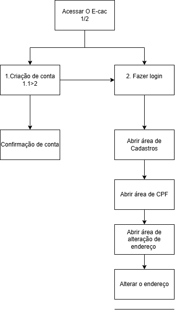
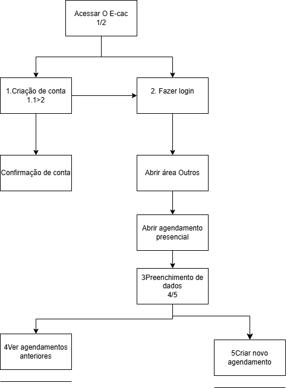
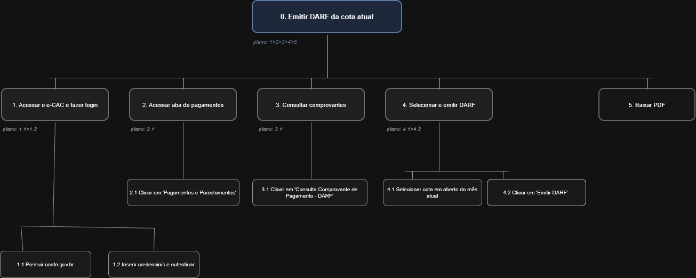
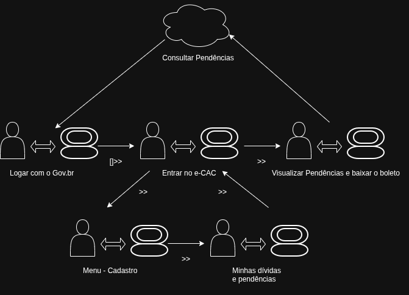

## Introdução 

A análise de tarefas é uma prática fundamental em IHC voltada para o entendimento profundo do trabalho dos usuários: o que eles fazem, como fazem e por quais motivos. Ela define o trabalho em termos dos objetivos que as pessoas precisam atingir e das ações necessárias para alcançá-los.

Dentro das técnicas de análise de tarefas pode-se citar: 

- HTA (Análise Hierárquica de Tarefas): Decompõe objetivos complexos em subobjetivos e operações, relacionando o que as pessoas fazem, por que o fazem e quais as consequências de possíveis erros.
- GOMS (Goals, Operators, Methods, and Selection Rules): Descreve o conhecimento necessário para tarefas rotineiras através de objetivos e métodos, permitindo prever o desempenho de usuários competentes em sistemas computacionais.
- Árvores de Tarefas Concorrentes (CTT): Representa graficamente a hierarquia das tarefas e as relações temporais e lógicas de concorrência entre as ações realizadas pelo usuário e pelo sistema.

## Tabela de contribuição

Segue na tabela 1, a contribuição de cada membro da equipe sobre essa etapa:

**Tabela 1 - Tabela de contribuição**

| Autor | Análises realizadas | Data |
| :--- | :--- | :--- |
| [Heyttor Augusto](https://github.com/H3ytt0r62) | Criação dos diagramas e tabelas 1.1, 1.2 e 2.1 | 02/05/2026 |
| [João Morais](https://github.com/Blazemorales) | Criação do diagrama 3.1 e Análise GOMS | 02/05/2026 |
| [Rafael Melatti](https://github.com/Romm-0) | [Análise GOMS 2.3](#23-leilao-da-receita-federal) | 02/05/2026 |
| [Thiago Gomes](https://github.com/thgomxs) | Criação da HTA 1.3 e Análise GOMS 2.4 | 02/05/2026 |

## HTA - Análise Hierárquica de Tarefas

### 1.1 - Alteração de endereço vinculado ao CPF

Na imagem 1.1, é possível observar o diagrama para a tarefa de alteração de endereço, e logo depois na tabela 1.1 para explicar o diagrama.

**Imagem 1.1 - Alteração de endereço**

Autor: [Heyttor Augusto](https://github.com/H3ytt0r62)

**Tabela 1.1 - Alteração de endereço**

| Objetivos e operações | Problemas e recomendações |
| :--- | :--- |
| 0. Acessar o E-cac | **feedback:** ser jogado na página de login |
| 1. Criação de conta | **input:** dados de cadastro **feedback:** usuário redirecionado para a página de confirmação de email. **plano:** confirmar conta e depois fazer login. |
| 1.1 Confirmação de conta | **feedback:** após confirmar o email o usuário é liberado para fazer login. |
| 2. Fazer login | **input:** dados de login. **feedback:** usuário redirecionado para a página de meu painel. **plano:** abrir área cadastros. |

### 1.2 - Agendamento

Na imagem 1.2, é possível observar o diagrama para a tarefa de cadastro de atendimento presencial, e logo depois na tabela 1.2 para explicar o diagrama.

**Imagem 1.2 - Agendamento presencial**

Autor: [Heyttor Augusto](https://github.com/H3ytt0r62)

**Tabela 1.2 - Agendamento Presencial**

| Objetivos e operações | Problemas e recomendações |
| :--- | :--- |
| 0. Acessar o E-cac | **feedback:** ser jogado na página de login |
| 1. Fazer login | **input:** dados de login. **feedback:** usuário redirecionado para a página de meu painel. |
| 2. Selecionar agendamento | **input:** clique em agendamento presencial. |
| 3. Preenchimento de dados | **input:** dados do usuário. **problema:** se o usuário não tiver agendamentos não aparecerá nada na tela |

### 1.3 - Emissão de DARF para pagamento de cota do IRPF

Na imagem 1.3, é possível observar o diagrama para a tarefa de emissão de um DARF de cota vigente, detalhado na tabela 1.3.

**Imagem 1.3 - Emissão de DARF**

Autor: [Thiago Gomes](https://github.com/thgomxs)

**Tabela 1.3 - Emissão de DARF**

| Objetivos e operações | Problemas e recomendações |
| :--- | :--- |
| 0. Emitir DARF da cota atual | **plano:** fazer login, navegar até pagamentos, consultar e gerar o documento. |
| 1. Acessar o e-CAC e fazer login | **input:** credenciais gov.br. **feedback:** direcionamento à tela inicial. |
| 2. Acessar aba de pagamentos | **input:** clique em "Pagamentos e Parcelamentos". **feedback:** carregamento das opções de pagamento. |
| 3. Consultar comprovantes | **input:** clique em "Consulta Comprovante de Pagamento - DARF". |
| 4. Selecionar e emitir DARF | **input:** selecionar a cota em aberto do mês atual e clicar em "Emitir DARF". **problema:** sistema pode demorar a carregar a lista de cotas. |
| 5. Baixar PDF | **input:** clique no botão de download. **feedback:** arquivo salvo no dispositivo do usuário. |

## GOMS (Goals, Operators, Methods and Selection Rules)

### 2.1 - Autorização da visualização de dados

Nessa tarefa, o usuário possui o objetivo de autorizar a visualização de seus dados para empresas, por certo período de tempo.

- GOAL 0: Fazer login na página para visualizar a página PRONAMPE
    - GOAL 1: Acessar aba meu painel
        - OP 1.1: Guiar o mouse para a aba meu painel
        - OP 1.2: Pressionar o botão
    - GOAL 2: Selecionar a opção compartilhar meus dados
        - OP 2.1: Guiar o mouse para a opção 'autorizar compartilhamento'
        - OP 2.2: Clicar na opção
    - GOAL 3: Criar uma nova autorização
        - OP 3.1: Guiar o mouse para a opção 'autorizar compartilhamento'
        - OP 3.2: Clicar na opção
        - OP 3.3: Guiar o mouse para a "próxima etapa"
        - OP 3.4: Clicar na opção
    - GOAL 4: Selecionar o tipo de dado a ser compartilhado
        - OP 4.1: Guiar o mouse para a opção 'Selecionar tipo de dado'
        - OP 4.2: Clicar na opção
        - OP 4.3: Guiar o mouse para a "próxima etapa"
        - OP 4.4: Clicar na opção "próxima etapa"
     - GOAL 5: Selecionar a data limite do compartilhamento
        - OP 5.1: Digitar a data limite
        - OP 5.2: Guiar o mouse para a "próxima etapa"
        - OP 5.3: Clicar na opção "próxima etapa"
     - GOAL 6: Selecionar a empresa que vai ter o compartilhamento 
        - OP 6.1: Guiar o mouse para a opção 'Destinatário para a leitura'
        - OP 6.2: Guiar o mouse dentre as opções disponíveis
        - OP 6.3: Digitar na barra de pesquisa a empresa desejada
        - OP 6.4: Clicar na opção
        - OP 6.5: Guiar o mouse para a "próxima etapa"
        - OP 6.6: Clicar na opção "próxima etapa"
    - GOAL 7: Autorizar o compartilhamento
        - OP 7.1: Guiar o mouse para "autorizar"
        - OP 7.2: Clicar na opção

### 2.2 - Meu Imposto de Renda 

Nessa tarefa, o usuário possui o objetivo de Declarar seu imposto de renda. 

- GOAL 0: Fazer login na página para visualizar a aba de "serviços mais acessados"
    - GOAL 1: Acessar o menu principal
        - OP 1.1: Clicar em "entrar com meu gov.br"
        - OP 1.2: Preencher os dados
        - OP 1.3: Pressionar o botão de confirmar
    - GOAL 2: Selecionar a opção "Meu Imposto de Renda" no meu "Serviços mais acessados"
        - OP 2.1: Clicar em Serviços do IRPF
        - OP 2.2: Clicar na opção "Fazer Declaração"
        - OP 2.3: Clicar no ano de declaração
    - GOAL 3: Fazer a declaração
        - OP 3.1: Clicar em cada categoria, uma por vez
        - OP 3.2: Preencher os dados da categoria
        - OP 3.3: Preencher todas as categorias, conforme os passos anteriores
    - GOAL 4: Enviar Declaração
        - OP 4.1: Clicar em "Entrega - Enviar Declaração"

### 2.3 - Leilão da Receita Federal

Nessa tarefa, o usuário possui o objetivo de dar um lance em um leilão da Receita Federal.

- GOAL 0: Fazer login no portal e-CAC para ter acesso a função do leilão
    - GOAL 1: acessar o sistema oficial de leilão.
        - OP 1.1: abrir o Portal e-CAC.
        - OP 1.2: autenticar com conta Gov.br nível Prata ou Ouro, ou com e-CPF/e-CNPJ quando aceito.
        - OP 1.3: localizar a opção “Participar de leilão eletrônico da Receita Federal” ou usar a busca de serviços.
    - GOAL 2: escolher o edital e o lote certo.
        - OP 2.1: consultar os editais disponíveis no portal.
        - OP 2.2: ler o edital e o Manual do Licitante antes de agir.
        - OP 2.3: verificar regras do lote, prazos e se há restrição para pessoa física ou jurídica.
    - GOAL 3: enviar a proposta na fase fechada.
        - OP 3.1: abrir o lote desejado.
        - OP 3.2: registrar, alterar ou excluir a proposta dentro do período definido no edital.
        - OP 3.3: informar um valor máximo coerente com o que pretende pagar, porque a classificação para lances depende da proposta apresentada.
    - GOAL 4: entrar na sessão de lances.
        - OP 4.1: aguardar a classificação automática das propostas.
        - OP 4.2: confirmar se a proposta ficou apta para a fase aberta.
        - OP 4.3: ofertar lances durante a sessão pública, acompanhando o melhor lance exibido no sistema.
    - GOAL 5: concluir a arrematação.
        - OP 5.1: consultar o resultado e a ata do leilão.
        - OP 5.2: emitir e pagar o DARF quando houver arremate.
        - OP 5.3: seguir o edital para retirada do lote, porque a Receita informa que a entrega não é feita por ela e o prazo costuma ser definido no próprio edital.

### 2.4 - Consulta de Pendências na Malha Fina

Nessa tarefa, o usuário (cidadão) deseja verificar quais são as inconsistências detalhadas de sua declaração retida na malha fina.

- GOAL 0: Fazer login no portal e-CAC com conta gov.br
    - GOAL 1: Acessar seção de declarações
        - OP 1.1: Guiar o mouse até a aba "Declarações e Demonstrativos"
        - OP 1.2: Clicar na aba
    - GOAL 2: Acessar extrato do IRPF
        - OP 2.1: Guiar o mouse até "Meu Imposto de Renda (Extrato da DIRPF)"
        - OP 2.2: Clicar na opção
    - GOAL 3: Selecionar o ano-calendário pendente
        - OP 3.1: Guiar o mouse até o ano correspondente na lista
        - OP 3.2: Clicar no ano-calendário
    - GOAL 4: Visualizar a pendência detalhada
        - OP 4.1: Guiar o mouse até a seção "Pendências de Malha"
        - OP 4.2: Clicar na seção
        - OP 4.3: Ler as divergências apontadas pelo sistema (ex: despesas médicas)

## CTT (ConcurTaskTrees)

### 3.1 - Minhas Pendências

Na imagem abaixo, é possível observar o diagrama de CTT para a tarefa de Consultar Minhas Pendências, entrando no e-CAC mobile (site no navegador do telefone celular).

**Imagem 3.1 - Minhas dívidas e pendências**

Autor: [João Morais](https://github.com/Blazemorales)

## Versionamento 

| Versão | Data | Descrição | Autor(es/as) | Revisor(es/as) |
| :--- | :--- | :--- | :--- | :--- |
| 1.0 | 02/05/2026 | Iniciação do documento e da análise | [Heyttor Augusto](https://github.com/H3ytt0r62) | [Rafael Melatti](https://github.com/Romm-0) |
| 1.1 | 02/05/2026 | Análises de Tarefas por João | [João Morais](https://github.com/Blazemorales) | [Rafael Melatti](https://github.com/Romm-0) |
| 1.2 | 02/05/2026 | Análises de Tarefas por Rafael e correções | [Rafael Melatti](https://github.com/Romm-0) | [Thiago Gomes](https://github.com/thgomxs) |
| 1.3 | 02/05/2026 | Análises de Tarefas por Thiago, correções e padronização | [Thiago Gomes](https://github.com/thgomxs) | - |