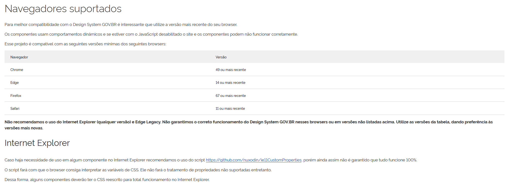

## Introdução

As caracteristicas de uma plataforma é tudo aquilo que compõe aquele sistema envolvendo ferramentas usadas para suas criação, UI,  desempenho do software , Funcionalidades, Arquitetura, Requisitos (Funcionais e Não-Funcionais), Atributos de Qualidade ou Stack Tecnológica.  
É importante reconhecer todas elas para conseguir comprrender as possiveis otimizações, evolução de produto e valor ao usuário.

- OBS.: Todos os tópicos referentes a **Análise da Estilização Atual e Possibilidades de Alteração do Design do Sistema** estão presentes em [**Guia de EStilo**](../guia_de_estilo/guia_de_estilo.md)

---

## Metodologia

Nesta etapa, os integrantes dividiram as caracteriscas do projeto de maneira que cada uma ficasse com pelo menos uma, eles tem o objetivo de reconhecer e documentar a caracristica escolhida e reconhcer possiveis so problemas se possivel.

---

## Tabela de contribuição 

| Autor | Análises realizadas | Data |
| :--- | :--- | :--- |
| [Heyttor Augusto](https://github.com/H3ytt0r62) | [Análise das ferramentas da plataforma](#1-análise-das-ferramentas-da-plataforma) | 11/05/2026 |
| [Rafael Melatti](https://github.com/Romm-0) | [Navegadores recomendados](#5-navegadores-recomendados) | 10/05/2026 |
| [João Morais](https://github.com/Blazemorales) | [Características negativas](#4-características-negativas) | 11/05/2026 |
| [Thiago Gomes](https://github.com/thgomxs) | [Características positivas](#3-características-positivas) | 11/05/2026 |
| [Lucas Gabriel](https://github.com/lucasz-g) | [Principais características](#2-principais-características) | 12/05/2026 |
| [João Morais](https://github.com/Blazemorales) | Correções com feedback do professor após as apresentações 3 e 4| 21/05/2026 |

---

### 1. Análise Das Ferramentas Da Plataforma

Foi usada a extensão do Google Wappalyser para inspecionar a pagina do portal E-cac e assim verificar quais ferramentas foram usandas em sua plataforma. Assim que foi possivel observar que as ferramentas usadas foram:

- HCaptcha - é uma ferramenta de segurança digital que serve para proteger sites e aplicativos contra robôs automatizados (bots), spam e fraudes
- JQuery Ui (1.8.11) - Uma biblioteca Javascript de componentes gráficos e interações construídas sobre o framework JQuery
- JQuery (1.4.2) É a biblioteca de JavaScript mais popular do mundo, podendo ser usada para  simplificar tarefas como percorrer e manipular documentos HTML, lidar com eventos, criar animações e usar Ajax, com uma API fácil de usar que funciona em diversos navegadores.

### 2. Principais Características 

Nesta seção, serão apresentadas as principais características estruturais e funcionais da plataforma e-CAC (Centro Virtual de Atendimento ao Contribuinte).

O e-CAC é uma plataforma web da Receita Federal desenvolvida para disponibilizar serviços tributários e fiscais de forma digital. O sistema permite que contribuintes realizem consultas, solicitações e acompanhamentos administrativos pela internet.

As principais características identificadas foram:

### 2.1 Centralização de Serviços

A plataforma reúne diversos serviços fiscais em um único ambiente digital, como consultas tributárias, processos digitais, parcelamentos e emissão de documentos.

### 2.2 Integração com GOV.BR

O acesso ao sistema ocorre principalmente pela autenticação integrada com o GOV.BR, além do suporte ao uso de certificado digital.

### 2.3 Tecnologias Web

Durante a análise da plataforma, foram identificadas ferramentas como JQuery, JQuery UI e HCaptcha, utilizadas para interface, interação e segurança do sistema.

### 2.4 Comunicação Digital

O e-CAC disponibiliza comunicação direta com o contribuinte através da Caixa Postal Eletrônica, utilizada para avisos e notificações oficiais.

### 2.5 Serviços Totalmente Digitais

Grande parte das funcionalidades pode ser realizada remotamente, reduzindo burocracias e atendimentos presenciais.

### 2.6 Compatibilidade com Navegadores

A plataforma funciona em navegadores modernos como Chrome, Firefox, Edge e Safari, sendo necessário o uso de JavaScript para funcionamento adequado. Já que não possui documentação sobre adequação de tecnologia, utilizamos, como parâmetro, o site do GOV.BR - já que o e-CAC é operado pela Receita Federal, vinculada aos sistemas do Governo do Brasil - e testes em grupo para identificar em quais navegadores o sistema opera. 

Dessa forma, o e-CAC se caracteriza como uma plataforma digital governamental voltada para centralização e digitalização dos serviços tributários brasileiros.

### 3. Características Positivas
Nesse tópico, serão descritas as características positivas da plataforma e-CAC. Segundo BARBOSA (2021, p. 99), o designer precisa ter conhecimento das necessidades dos usuários/interessados na plataforma. Uma das maneiras de investigar essas necessidades está nas características positivas do sistema. Ao analisar quais são as funcionalidades eficientes e o que gera satisfação, compreendemos o que agrega valor ao usuário e o que deve ser rigorosamente preservado na solução. 

Para identificar características positivas da plataforma, utilizaremos estas métricas, os critérios de usabilidade, propostas por BARBOSA (2010, p. 29)<a class="ref-link" data-img="../../../images/metas_sa/image10.png" data-alt="Usabilidade">[ref.]</a>: 

- Facilidade de Aprendizado;
- Facilidade de Memorização;
- Eficiência;
- Segurança no Uso;
- Satisfação do Usuário;

Dados esses critérios, podemos ver quais são critérios que os usuários avaliam como **pontos positivos**.

As características ditas como **positivas** pelos usuários foram:

1. **Centralização de Serviços Tributários**;
2. **Autenticação Integrada (GOV.BR)**;
3. **Autonomia e Redução de Burocracia**;
4. **Comunicação Direta (Caixa Postal Eletrônica)**;
5. **Indispensabilidade  para Profissionais**;

Em suma, os elementos acima descrevem as **características positivas** da plataforma.

### 4. Características Negativas
Nesse tópico, serão descritas as características negativas da plataforma e-CAC. Segundo BARBOSA (2021, p. 99) <a class="ref-link" data-img="../../../images/carac_pat/image.png" data-alt="Planejamento de Intervenção">[ref.]</a>, o designer precisa ter conhecimento das necessidades dos usuários/interessados na plataforma. Uma das maneiras de investigar essas necessidades está nas características negativas do sistema. Ao analisar quais são os defeitos, de onde vêm e onde impactam, nos auxiliam a desenvolver uma solução que atenda aquilo que desagrada aos usuários. 

Para identificar características negativas da plataforma, utilizaremos estas métricas, os critérios de usabilidade, propostas por BARBOSA (2010, p. 29)<a class="ref-link" data-img="../../../images/metas_sa/image10.png" data-alt="Usabilidade">[ref.]</a>: 

- Facilidade de Aprendizado;
- Facilidade de Memorização;
- Eficiência;
- Segurança no Uso;
- Satisfação do Usuário;

Dados esses critérios, e considerando avaliações dos participantes dadas durante o [Brainstorming](../../images/planejamento/quadro_bs/quadrobs.png), podemos ver quais são critérios que os usuários avaliam como **pontos negativos**.

As características ditas como **negativas** pelos usuários foram:

1. **Fontes pequenas**;
2. **Ausência de categorização dos tópicos por eixos temáticos**;
3. **Dificuldade de acesso às funções mais usadas**;
4. **Linguagem Complexa**;
5. **Ocupação ruim da tela pelo sistema (muitos espaços em branco)**;
6. **Instruções rasas em informação**;
7. **Insegurança em alcançar a funcionalidade final**;

#### 4.1 Possibilidades de solução

Como possibilidades de solução para essas características, propomos: 

1. Aumentar fontes (de 12 px para 16px);
2. Categorizar tópicos em quadros da seguinte forma: 

    - Situação Fiscal: Consultar CPF, Consultar Débitos e Pendências
3. Quadro na página inicial, logo no topo do corpo de texto, com as funcionalidades mais acessadas;
4. Linguagem simples, popular e concisa, evitando o uso de termos técnicos;
5. Ocupação da tela com ícones e com melhor enquadramento para ocupar melhor a página;
6. Demonstrar um guia, no topo da página, que mostre o caminho percorrido pelo usuário (Ex.: Menu Inicial > Consultar CPF > Minhas Pendências), e o uso de avisos (Ex.: Você deseja consultar suas pendências? Deseja cancelar a operação?), ausentes no site. 

### 5. Navegadores Recomendados

As fontes oficiais foram consultadas para verificar se a Receita Federal ou o gov.br tinham recomendações de quais navegadores são ideias para utilizar o Portal e-CaC, mas nenhuma documentação foi encontrada.  
Por causa disso, partimos do pressuposto de que os requisitos mínimos para o gov.br são equivalentes aos demais serviços oferecidos por eles, sendo um deles o e-CaC.  
Os nagevadores recomendados para a versão 3.7.0, a mais recente na data 10/05/2026, são:

| Navegador | Versão |
| :--- | :--- |
| Chrome | 49 ou mais recente |
| Edge | 14 ou mais recente |
| Firefox | 67 ou mais recente |
| Safari | 11 ou mais recente |

A origem da informação pode ser visualizada na [imagem 1](#imagem-1) 
Além das versões terem que ser compatíveis, é recomendado que o navegador esteja com o javascript ativado para garantir o funcionamento esperado do site. Outros navegadores com a engine igual aos dos recomendados também funcionam.

---

#### Imagem 1

Fonte: Receita Federal do Brasil. Portal e-CAC. GOV.BR. Disponível em: https://www.gov.br/receitafederal/pt-br/canais_atendimento/atendimento-virtual. Acesso em: 11 maio 2026.

---

## Bibliografia

- Portal E-cac, **Portal E-cac**,https://www.gov.br/receitafederal/pt-br/canais_atendimento/atendimento-virtual, Acesso em: 11/05/2026
- Serviços do E-cac, **GOV**,https://servicos.receita.fazenda.gov.br/Servicos/servicos-ecac/default.aspxl, Acesso em: 11/05/2026
- [Navegadores recomendados](#imagem-1), **GOV**, https://www.gov.br/ds/guias/navegadores-suportados, Acesso em: 10/05/2026

---

## Referência Bibliografia
- BARBOSA, S. D. J.; SILVA, B. S. da. Interação humano-computador. Rio de Janeiro: Elsevier, 2010.
- BARBOSA, S. D. J.; SILVA, B. S. da. Interação humano-computador. Rio de Janeiro: Elsevier, 2021.

---

## Versionamento 

| Versão | Data | Descrição | Autor(es/as) | Revisor(es/as) |
| :--- | :--- | :--- | :--- | :--- |
| 1.0 | 10/05/2026 | Iniciação do documento | [Heyttor Augusto](https://github.com/H3ytt0r62) e [Rafael Melatti](https://github.com/Romm-0) | [Lucas Gabriel](https://github.com/lucaszg-g) |
| 1.1 | 11/05/2026 | Características Negativas | [João Morais](https://github.com/Romm-0) | [Lucas Gabriel](https://github.com/lucaszg-g) |
| 1.2 | 11/05/2026 | Adição das Características Positivas | [Thiago Gomes](https://github.com/thgomxs) | [Lucas Gabriel](https://github.com/lucaszg-g) |
| 1.3 | 11/05/2026 | Adição das ferramentas |[Heyttor Augusto](https://github.com/H3ytt0r62)| [Lucas Gabriel](https://github.com/lucaszg-g) |
| 1.4 | 11/05/2026 | Correções gerais e adição da [Referência Bibliografia](#referência-bibliografia) |[Lucas Gabriel](https://github.com/lucaszg-g)| - |
| 1.5 | 11/05/2026 | Correções gerais e adição das [Principais Características](#2-principais-características) |[Lucas Gabriel](https://github.com/lucaszg-g)| - |
| 1.6 | 12/05/2026 | Correções gerais |[Lucas Gabriel](https://github.com/lucaszg-g)| - |
| 1.7 | 21/05/2026 | Correção pós apresentação das etapas 3 e 4 | [João Morais](https://github.com/Blazemorales) | - |