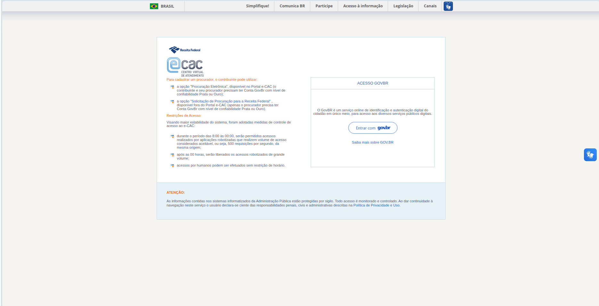
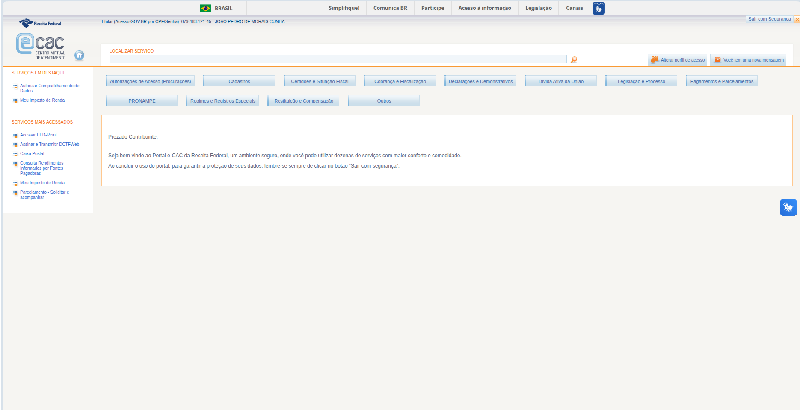
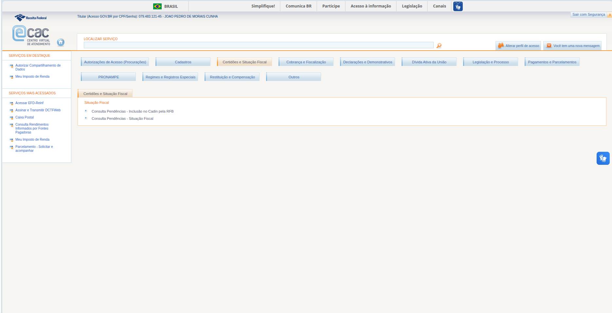
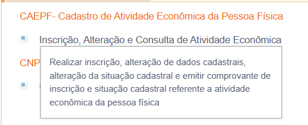

## Introdução

Guia de estilo é um artefato da Interação-Humano-Computador (IHC), funcionando como um documento que registra as decisões de design para garantir a consistência de um produto ou de uma família de produtos. Sua principal finalidade é servir como uma ferramenta de comunicação entre designers e desenvolvedores, assegurando que a visão de qualidade de uso e a identidade visual sejam preservadas fielmente desde a concepção até a implementação final e manutenções futuras.  

Ao padronizar elementos como grids de layout, tipografia, paleta de cores e o comportamento de componentes da interface, o guia reduz a carga cognitiva do usuário e facilita o aprendizado do sistema.
Além de promover a eficiência da equipe de desenvolvimento, este documento fundamenta a metacomunicação do designer, permitindo que o usuário compreenda a lógica do produto de forma clara e intuitiva, minimizando possíveis rupturas na interação.

---

## Tabela de contribuição 

 | Autor | Análises realizadas | Data |
| :--- | :--- | :--- |
| [Heyttor Augusto](https://github.com/H3ytt0r62) | [Análise dos elementos visuais do site](#gui-4) | 11/05/2026 |
| [Rafael Melatti](https://github.com/Romm-0) | [Análise do vocabulário e padrões](#gui-3) | 11/05/2026 |
| [João Morais](https://github.com/Blazemorales) | [Elementos de interface](#gui-1) | 11/05/2026 |
| [Thiago Gomes](https://github.com/thgomxs) | [Elementos de ação](#gui-2) | 11/05/2026 |
| [Lucas Gabriel](https://github.com/lucaszg-g) | [Analise final do guia de estilo](#gui-5) | 12/05/2026 |
| [João Morais](https://github.com/Blazemorales) | Correções com feedback do professor após as apresentações 3 e 4| 21/05/2026 |

## Metodologia

Para este artefato os alunos separam varios aspectos do guia de estilo do site para analisaram separadamente, nessa análise, buscaram entender e documentos o padrão do site em cada aspecto, de criticar possiveis erros encontrados e adicionar sugestões se acharam necessário. 

Foi encontrado também ao fazer pesquisas relacionadas a esse tema o guia de estilo de sites da receita federal na qual o grupo usou para verificar se o site do e-CaC está em conformidade com o guia de estilo oficial encontrado.

---

### 1. Elementos de interface {#gui-1}

Segundo BARBOSA (2021, p. 283), no guia de estilo, os elementos de interface <a class="ref-link" data-img="../../../../images/planejamento/bs/image.png" data-alt="Usabilidade">[ref.]</a>: <a class="ref-link" data-img="../../images/guiadeestilos/image0.png" data-alt="Elementos de Interface">[ref.]</a> são descritos no guia de estilos seguindo a estrutura:

1. Disposição espacial e grid
2. Janelas
3. Tipografia
4. Símbolos não tipográficos
5. Cores
6. Animações

A análise abaixo foi realizada a partir de três telas distintas do sistema: a **Tela de Login**, a **Tela/Menu Inicial** (com mensagem de boas-vindas) e a **Navegação/Tela por Categoria** (exemplo: "Certidões e Situação Fiscal"), permitindo observar tanto o estado padrão quanto comportamentos de seleção e exibição de subitens. As imagens das telas, usadas como referência para a análise dos elementos da interface, estão abaixo:

1. Tela de Autenticação

Referência: eCAC - Centro Virtual de Atendimento. Disponível em: https://cav.receita.fazenda.gov.br/autenticacao. Acesso em 12/05/2026.

---

2. Menu Inicial

Referência: eCAC - Centro Virtual de Atendimento. Disponível em: https://cav.receita.fazenda.gov.br/ecac. Acesso em 12/05/2026.

---

3. Navegação por Categoria

Referência: eCAC - Centro Virtual de Atendimento. Disponível em: https://cav.receita.fazenda.gov.br/ecac/#. Acesso em 12/05/2026.

---

Com base nisso, abaixo, serão descritos os elementos de interface baseado no modelo supracitado:

#### 1.1. Disposição espacial e grid

O e-CAC apresenta dois padrões de layout distintos, dependendo do contexto da página: a tela de autenticação (pré-login) e a área interna do portal (pós-login).

- **Tela de Login**:
    - O sistema adota um *container* central com largura fixa em torno de 880–900 px, recuado do topo do viewport. Acima dele há a barra "BRASIL" do Governo Federal ocupando 100% da largura, com cerca de 36 px de altura. O card principal utiliza um grid de duas colunas assimétrico: a coluna esquerda (~55% da largura) contém o *branding* e o bloco textual com instruções e restrições, enquanto a coluna direita (~45%) abriga a caixa "ACESSO GOVBR". O alinhamento vertical é *top-aligned*, ou seja, ambos os blocos começam do topo do card, deixando o lado direito visualmente mais "curto". As margens internas do card branco são de aproximadamente 30–40 px nas laterais e 30 px no topo e base.

- **Tela Inicial**: 

    - Apresenta uma estrutura completamente diferente, com layout fluido em largura total (acima de 1500 px). Possui um cabeçalho duplo (faixa de menu institucional + faixa com identidade do contribuinte logado), uma *sidebar* esquerda fixa de aproximadamente 180 px com seções "SERVIÇOS EM DESTAQUE" e "SERVIÇOS MAIS ACESSADOS", e uma área de conteúdo principal que ocupa o restante da largura sem *max-width* perceptível. Os botões de categoria se distribuem horizontalmente com espaçamento de cerca de 8–10 px entre si, usando um sistema de *flex-wrap* sem colunas rígidas.

- **Navegação por Categoria**: 
    - O layout introduz uma **terceira região vertical** abaixo da grade de botões: um painel de resultados com largura fluida (preenchendo todo o espaço entre a sidebar e a borda direita do viewport), separado dos botões por aproximadamente 20 px de respiro vertical. Esse painel possui sua própria estrutura interna em três níveis hierárquicos verticais — aba ativa (~30 px de altura), título da subseção (~25 px) e lista de links (com itens espaçados por ~12 px) — todos alinhados à esquerda, com indentação progressiva: a lista de links é indentada em ~30 px em relação à borda do painel, criando uma hierarquia visual em árvore.

#### 1.2. Janelas

Os componentes de container do e-CAC seguem um estilo visual antigo. 

- Login: 
    - O **card principal de login** possui fundo branco puro, com borda extremamente sutil (ou ausente), sem *border-radius* perceptível e sem *box-shadow* visível — diferencia-se do fundo apenas pelo contraste de luminância entre branco e cinza-pálido.

    - A **caixa "ACESSO GOVBR"** é um container menor aninhado na coluna direita, com borda fina cinza (aproximadamente 1 px sólido, tom #D0D0D0), cabeçalho separado do corpo por uma linha horizontal fina, cantos retos e padding interno generoso de cerca de 25–30 px. Dentro dela, o botão "Entrar com gov.br" é o único elemento com cantos arredondados (estilo *pill*, com *border-radius* alto), herdado do *design system* oficial do gov.br.

    - O texto **"ATENÇÃO"** possui largura idêntica ao card branco, fundo azul-bebê (~#E6F0F8), sem borda visível e padding interno de aproximadamente 20 px.

- Menu Inicial: 
    - **Barra Lateral Esquerda**: tem fundo branco sem borda visível, separando-se da área de conteúdo apenas por uma linha vertical fina. 

    - **Card Central de Boas-Vindas** apresenta uma moldura laranja fina (~1 px, cor próxima de #E89B3C) que funciona como destaque visual.

    - **Botões de Categoria**: possuem aparência tridimensional antiga, com gradiente vertical sutil em tons de azul-claro, borda fina cinza-azulada, cantos levemente arredondados (~3–4 px), largura variável conforme o texto e altura aproximada de 28 px. No **estado ativo/selecionado** (observado no botão "Certidões e Situação Fiscal" da tela de categoria expandida), o botão perde o gradiente azul-claro e adota fundo branco com borda laranja superior mais espessa, perdendo também o efeito tridimensional — comportamento que sinaliza a conexão visual com o painel de resultados logo abaixo, criando um pseudo-vínculo de "tab + content area".

    - **Painel de Resultados por Categoria**: Aparece após a seleção de uma categoria. Possui: fundo branco, moldura laranja fina contornando todo o conteúdo (mesma cor #E89B3C usada no card de boas-vindas), uma **aba interna** no canto superior esquerdo (~180 px de largura, com texto preto sobre fundo branco e linha laranja inferior) que repete o nome da categoria selecionada, e padding interno de aproximadamente 15–20 px. A aba interna funciona como uma "etiqueta" do conteúdo, sobreposta à borda superior da janela — padrão típico de UIs antigas que imitavam fichários físicos.

#### 1.3. Tipografia

A família tipográfica principal utilizada é um conjunto de fontes sans-serif clássica, com fortes chances de seguir o modelo: `Arial, Helvetica, sans-serif`, ou `Verdana, Geneva, sans-serif`. 

A hierarquia tipográfica observada na tela de autenticação segue:

| Elemento | Tamanho aprox. | Peso | Cor |
| :--- | :--- | :--- | :--- |
| "BRASIL" (barra superior) | 11–12 px | Bold | Cinza-escuro |
| Headings de seção ("Para cadastrar…", "Restrições de Acesso") | 13 px | Bold | Laranja (~#D17A2A) |
| Corpo de texto (parágrafos e bullets) | 12 px | Regular | Cinza-escuro (~#555) |
| Links inline | 12 px | Regular | Azul (~#0066CC) |
| "ACESSO GOVBR" (título do card) | 13 px | Regular | Cinza-escuro |
| Botão "Entrar com gov.br" | 14 px | Bold | Azul-escuro |
| "ATENÇÃO:" | 12–13 px | Bold | Laranja |

- **Menu Inicial**: mantém o mesmo padrão, com adições como o menu superior em Bold cinza (13 px), labels de seção em caixa alta laranja (11 px Bold) e texto dos botões de categoria em azul-marinho (~#1A4B7D) com peso Regular (12 px).

- **Tela de Categoria Expandida - Painel de Resultados**: o nome da aba interna ("Certidões e Situação Fiscal") aparece em 12 px Regular, cor preta sobre fundo branco — diferente do azul-marinho usado no botão; o título da subcategoria ("Situação Fiscal") aparece em 12 px Bold na mesma cor laranja dos headings (~#D17A2A); e os links de serviço ("Consulta Pendências - Inclusão no Cadin pela RFB" etc.) aparecem em 12 px Regular, cor cinza-escura (~#555) — **não em azul de link**, apesar de serem clicáveis. Essa última escolha quebra a convenção visual estabelecida no restante do site, onde links interativos são sempre azuis, e pode prejudicar a affordance.

- **Outros**: a altura de linha (*line-height*) modesta (~1.3–1.4), o *letter-spacing* é normal exceto nos cabeçalhos em laranja (com *tracking* adicional), e o Headings de seção são consistentemente apresentados em laranja e caixa alta, criando um sistema visual uniforme entre as telas.

#### 1.4. Símbolos não tipográficos

O sistema utiliza **ícones bitmap pequenos**. O elemento mais recorrente são os **bullets quadrados azul-amarelo-vermelho** (~12×12 px, estilo *flat* com cores chapadas) que aparecem antes de cada item de lista nas duas telas.

- **Tela de Categoria Expandida**: nos itens da lista de serviços ("Consulta Pendências..."), o bullet aparece em uma versão **azul-claro chapada simplificada** (~8×8 px), sem os elementos amarelos e vermelhos da versão usada na sidebar e na tela de autenticação.

Entre os logotipos identificados:
- **Brasão/bandeira do Brasil** na barra superior (~24×16 px, bitmap pequeno).
- **Logo Receita Federal** com tipografia institucional em azul-escuro e símbolo abstrato à esquerda.
- **Logo e-CAC**, com composição mais elaborada: um "@" estilizado em azul-claro com gradiente, seguido de "cac" em azul-escuro com efeito de contorno e a sigla "CENTRO VIRTUAL DE ATENDIMENTO" em capitulares pequenas abaixo.

Os ícones de ação da tela pós-login incluem: uma **lupa laranja** dentro do campo "LOCALIZAR SERVIÇO", o ícone de **"Alterar perfil de acesso"** (dois bonecos em laranja/marrom), o ícone de **"Você tem uma nova mensagem"** (envelope laranja) e o ícone **home** (casa laranja em círculo azul-claro).

O **ícone de acessibilidade VLibras** (mão estilizada com símbolo "I" sobre fundo azul-royal) aparece recorrentemente em ambas as telas, sendo o único elemento da barra superior com cantos arredondados visíveis (~28×28 px na barra fixa e ~36×36 px na versão flutuante).

Os **separadores** são linhas finas (~1 px, cinza ~#DDDDDD) usadas para dividir a barra superior do conteúdo, o cabeçalho do card "ACESSO GOVBR" do corpo, e as seções da sidebar. Linhas verticais finas separam itens do menu superior e o input da lupa no campo de busca. Na tela de categoria expandida, observa-se ainda uma **linha laranja horizontal** mais marcada logo abaixo da aba interna ativa, funcionando como reforço visual do "vínculo" entre a aba e o conteúdo abaixo.

Cabe destacar que **não há ilustrações, ícones SVG modernos, infográficos ou imagens decorativas** em nenhuma das telas. 

#### 1.5. Cores

A paleta de cores do e-CAC é organizada em torno de três grupos principais: azul institucional (cor primária), laranja (cor de destaque e ação, sendo considerada cor secundária) e neutros (cinzas).

**Paleta primária (azuis):**

| Função | Cor aproximada | Aplicação |
| :--- | :--- | :--- |
| Azul institucional escuro | `#1A4B7D` / `#2C5F8D` | Logo Receita Federal, texto de botões, links principais |
| Azul de link | `#0066CC` / `#1E73BE` | Links inline, "Saiba mais sobre GOV.BR" |
| Azul-claro (gradiente botões) | `#D8E4EF` → `#B8CFE0` | Botões de categoria na tela pós-login |
| Azul-royal | `#1E5AAE` | Botão VLibras e ícones de acessibilidade |
| Azul-bebê | `#E6F0F8` | Faixa "ATENÇÃO" na tela de autenticação |

**Cor de destaque (laranja institucional):**

| Função | Cor aproximada | Aplicação |
| :--- | :--- | :--- |
| Laranja para headings | `#D17A2A` / `#E89B3C` | Títulos de seção, "ATENÇÃO:", labels em caixa alta |
| Laranja para bordas | `#E89B3C` | Moldura do card de boas-vindas e do painel de resultados |
| Laranja para ícones | `#D17A2A` | Lupa, envelope, ícones de ação |
| Laranja para estado ativo | `#E89B3C` | Borda superior do botão de categoria selecionado, linha inferior da aba ativa |

**Neutros:**

| Função | Cor aproximada |
| :--- | :--- |
| Texto principal | `#333333` / `#555555` |
| Texto secundário | `#888888` |
| Fundo da página | `#EAEAEA` / `#E5E5E5` |
| Fundo de cards | `#FFFFFF` |
| Bordas finas | `#D0D0D0` / `#DDDDDD` |

A aplicação cromática segue uma lógica funcional: o fundo da página é cinza-pálido uniforme (sem texturas ou gradientes), os cards têm fundo branco diferenciado apenas por contraste de luminância, os botões usam gradiente vertical sutil em tons de azul-claro com texto azul-marinho, e os links são apresentados em azul puro sem sublinhado por padrão. **Não há paleta explícita** para estados de erro, sucesso ou aviso, nem suporte a modo escuro ou modo de alto contraste.

#### 1.6. Animações

**Animações presentes:**
- *Hover* em links: troca de cor (azul → azul mais escuro) ou aparecimento de sublinhado, com transição instantânea ou de aproximadamente 150 ms.
- *Hover* em botões de categoria: leve mudança de gradiente (clareamento ou escurecimento), provavelmente com `transition: background 200ms ease`.
- **Clique em botão de categoria**: transição de estado padrão (gradiente azul-claro) para estado ativo (fundo branco com borda laranja superior) acompanhada da renderização do painel de resultados abaixo. Pelo estilo do sistema, é provável que essa transição seja **instantânea**, sem animação de *fade* ou *slide* — o painel simplesmente aparece após uma requisição síncrona ao servidor.
- *Hover* no botão "Entrar com gov.br": escurecimento de borda ou fundo, mantendo o estilo *pill*.
- *Focus* em inputs: borda destacada em azul — comportamento padrão do navegador, sem customização sofisticada.

**Animações ausentes:**
- Micro-interações modernas (*button ripple*, *skeleton screens*, *fade-in* de conteúdo).
- Transições suaves entre páginas ou entre estados de categoria — cada seleção provoca recarregamento de seção sem animação.
- *Loading* sofisticado — provavelmente apenas o *spinner* padrão do navegador ou GIFs antigos.
- *Parallax*, *scroll-triggered animations*, *lazy-load* com *fade*.
- *Hover* de cartões com elevação (*shadow on hover*).
- Animações no botão de acessibilidade VLibras.

O *easing* e durações esperadas são tipicamente `transition: all 0.2s linear` ou CSS sem *easing* customizado, sem qualquer indicação de uso de bibliotecas modernas como GSAP, Framer Motion ou animações com `cubic-bezier` refinado.

### 2. Elementos de ação {#gui-2}

Os elementos de ação no portal e-CAC apresentam uma transição clara entre os padrões legados da Receita Federal e as diretrizes unificadas do **Padrão Digital de Governo (Design System do gov.br)**. A interface utiliza esses componentes para permitir que o contribuinte execute tarefas, obtenha informações ou interaja com formulários e declarações.

Abaixo estão os principais elementos mapeados e seus comportamentos no sistema:

* **Botões (Buttons):** * *Pré-login:* O botão principal de ação "Entrar com gov.br" segue estritamente o design system atual. Ele apresenta o formato *pill* (cantos totalmente arredondados), utiliza a cor azul-escuro institucional para alta prioridade e traz a tipografia em *bold*.
    * *Pós-login:* Os botões de navegação por categoria (ex: "Certidões e Situação Fiscal") seguem um padrão visual defasado. Eles apresentam um aspecto tridimensional com um leve gradiente azul-claro e bordas sutilmente arredondadas. Ao serem clicados (estado ativo), perdem o gradiente, ganham fundo branco e uma borda superior laranja espessa.
* **Links (Hyperlinks):**
    * São usados extensivamente tanto para navegação contextual (ex: "Saiba mais sobre GOV.BR") quanto para listar os serviços disponíveis na área logada. No padrão geral, adotam a cor azul clássica (`#0066CC`), garantindo o reconhecimento imediato de sua interatividade.
    * *Inconsistência:* No painel de resultados (tela de categoria expandida), os links que direcionam aos serviços da Receita aparecem em cinza-escuro (`#555`). Isso quebra a convenção de *affordance* visual adotada no resto da plataforma, forçando o usuário a deduzir que o texto estruturado em lista é clicável.
* **Tags e Abas de Interação:** * O e-CAC utiliza blocos textuais que funcionam como abas (no canto superior esquerdo dos painéis de resultado) para indicar e fixar o contexto da categoria selecionada. Visualmente, comportam-se como etiquetas de fichário em vez das *tags* em formato de pílula recomendadas pelas diretrizes mais recentes de design digital do governo.
* **Microcopy (Redação e Usabilidade):**
    * Enquanto o padrão gov.br exige o uso de verbos diretos no infinitivo para botões (ex: "Acessar", "Enviar"), a área interna do e-CAC adapta seu microcopy ao jargão técnico-contábil do seu público-alvo principal. Os elementos de ação frequentemente utilizam termos ancorados em legislações e sistemas legados (ex: "Consulta Pendências", "Emitir DARF"). Embora o uso excessivo de siglas e termos técnicos contrarie as heurísticas gerais para usuários leigos, garante eficiência e clareza para os profissionais do setor.

### 3. Vocabulário e padrões {#gui-3}

Em relação aos padrões, mesmo que eles tenham sido definidos no [guia de estilo](https://www.gov.br/receitafederal/pt-br/centrais-de-conteudo/guias-e-manuais/guia-de-estilos) da Receita Federal, eles não são cumpridos. 

Após analisado o site de forma completa não foi encontrado um padrão consistente em todo o site. Todas as rotas internas do site possuem o mesmo padrão, mas muitos dos serviços do próprio e-CaC estão em processo de migração para o gov.br, causando inconsistência no padrão adotado pelo site. Além disso, a aba de leilões da Receita Federal tem um padrão próprio, mesmo fazendo parte do e-CaC. 

Quanto ao vocabulário ele é majoritariamente voltado para o público da área contábil e financeira, usando termos técnicos e leis não simplificadas para dar as informações necessárias para o uso das funcionalidades do site. Ao mais, elas também não são padronizadas no guia de estilo.

### 4. Elementos visuais {#gui-4}

No guia de estilo encontrado pelos estudantes, não é mencionado em nenhum momento da página como os elementos visuais devem se comportar, deixando em aberto como esses elementos devem ser apresentados. Ao analisar os elementos visuais, é possível perceber uma falta de resolução nas imagens: tanto os ícones da Receita Federal quanto o ícone do e-CAC possuem resolução bastante baixa, o que transmite ao site uma impressão de amadorismo.

Outro ponto a se destacar são os ícones localizados ao lado dos botões e da barra de pesquisa, que também apresentam baixa resolução. Em contrapartida, um elemento visual positivo é o botão de Libras, que possui boa resolução, uma cor que se destaca do fundo branco do site e uma imagem de fácil entendimento para os usuários.Observe nas imagens 4 e 5 contendo os problemas encontrados

**4. imagem dos icones**

**5. Imagem dos icones de interrogação**

Como sugestão, o grupo analisou que o site necessita de uma atualização em seus ícones, de forma a deixá-los em conformidade com os demais elementos visuais presentes em outros sites da Receita Federal e do GOV.BR, tornando a interface mais familiar para o usuário. Além disso, recomenda-se substituir os elementos em formato quadrado que ficam ao lado dos serviços por ícones de interrogação, para deixar mais claro ao usuário que aquele elemento serve para esclarecer dúvidas sobre o serviço específico. 

### 5. Analise final do guia de estilo {#gui-5}

A partir das avaliações realizadas nos tópicos anteriores, conclui-se que o portal e-CAC carece de uma padronização unificada, apresentando uma identidade visual híbrida e fragmentada. O sistema encontra-se visivelmente em um estado de transição entre os padrões legados da Receita Federal e as diretrizes do Padrão Digital de Governo (gov.br), o que resulta no descumprimento de premissas essenciais de um guia de estilo, como garantir a consistência e reduzir a carga cognitiva do usuário.

Os principais pontos de atenção mapeados na análise incluem:

* **Inconsistência Arquitetural e de Padrões:** Não há um padrão visual consistente em toda a plataforma. Enquanto a tela de autenticação adota componentes modernos (como botões em formato *pill* do gov.br), a área interna e abas específicas (como a de leilões) possuem layouts próprios e defasados. Essa migração parcial causa rupturas na interação.
* **Problemas de *Affordance*:** Há uma quebra de expectativa no reconhecimento de elementos clicáveis. O uso de links em cinza-escuro no painel de resultados de categorias contraria a convenção estabelecida no próprio sistema de utilizar a cor azul para hiperlinks, forçando o usuário a deduzir a interatividade da lista.
* **Baixa Fidelidade Visual:** A utilização de ícones e logotipos em baixa resolução prejudica a estética da interface, transmitindo uma impressão de amadorismo no design. Além disso, os componentes visuais, como botões tridimensionais com gradientes e janelas em formato de "fichário", refletem um design de interface antigo e sem suporte a animações ou micro-interações modernas.
* **Vocabulário Segmentado:** O *microcopy* e os termos utilizados são altamente técnicos e ancorados em jargões contábeis e leis. Embora isso crie uma barreira para usuários leigos, foi avaliado que tal escolha garante eficiência e clareza para o público-alvo principal, composto por profissionais do setor.

**Considerações para Melhoria:**

Para que o guia de estilo cumpra seu papel de facilitar o aprendizado do sistema e preservar a visão de qualidade, é fortemente recomendada uma migração definitiva de todos os fluxos e componentes para o *design system* oficial do gov.br. Sugere-se a substituição imediata dos ativos visuais de baixa resolução por SVGs modernos, a padronização das cores de links para garantir *affordance*, e a substituição de ícones abstratos (como os *bullets* quadrados) por elementos com semântica clara (como ícones de interrogação para esclarecimento de dúvidas), tornando a interface mais intuitiva e familiar.

### 6. Agradecimentos

Agradecemos à ferramenta de IA [Claude](https://claude.ai/new), que foi usada para extrair os elementos do Layout e Grid. Ela nos forneceu estes elementos da estilização da página: tamanho das fontes em pixels, esquema de cores em rgb e hexadecimal, tamanho dos quadros, animações. As demais análises e textos foram feitas pelos membros do grupo.  

---

## Bibliografia

- Guia de estilo, **GOV**, 2023, https://www.gov.br/receitafederal/pt-br/centrais-de-conteudo/guias-e-manuais/guia-de-estilos, Acesso em: 11/05/2026
- Portal E-cac, **Portal E-cac**,https://www.gov.br/receitafederal/pt-br/canais_atendimento/atendimento-virtual, Acesso em: 11/05/2026
- Serviços do E-cac, **GOV**,https://servicos.receita.fazenda.gov.br/Servicos/servicos-ecac/default.aspxl, Acesso em: 11/05/2026
- BARBOSA, S. D. J.; SILVA, B. S. da. **Interação humano-computador**. Rio de Janeiro: Elsevier, 2010.

---

## Versionamento 

| Versão | Data | Descrição | Autor(es/as) | Revisor(es/as) |
| :--- | :--- | :--- | :--- | :--- |
| 1.0 | 11/05/2026 | Iniciação do documento e [análise dos elementos visuais](#4-elementos-visuais) | [Heyttor Augusto](https://github.com/H3ytt0r62) | [Rafael Melatti](https://github.com/Romm-0) |
| 1.1 | 11/05/2026 | Documentação de [Vocabulários e Padrões](#3-vocabulario-e-padroes) e correções | [Rafael Melatti](https://github.com/Romm-0) | - |
| 1.2 | 11/05/2026 | Documentação de [Elementos de Interface](#1-elementos-de-interface) e correções | [Rafael Melatti](https://github.com/Romm-0) | - |
| 1.3 | 11/05/2026 | Documentação de [Elementos de ação](#2-elementos-de-ação) | [Thiago Gomes](https://github.com/thgomxs) | - |
| 1.4 | 12/05/2026 | Documentação da [analise final do guia de estilo](#5-analise-final-do-guia-de-estilo) | [Lucas Gabriel](https://github.com/lucaszg-g) | - |
| 1.5 | 21/05/2026 | Correção pós apresentação das etapas 3 e 4 | [João Morais](https://github.com/Blazemorales) | - |