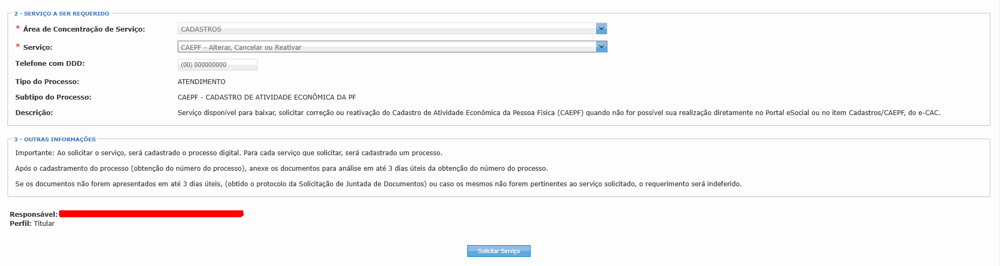
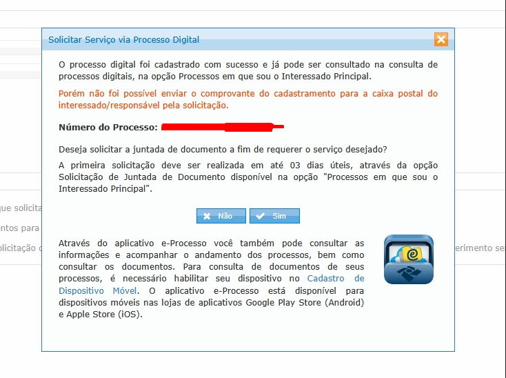
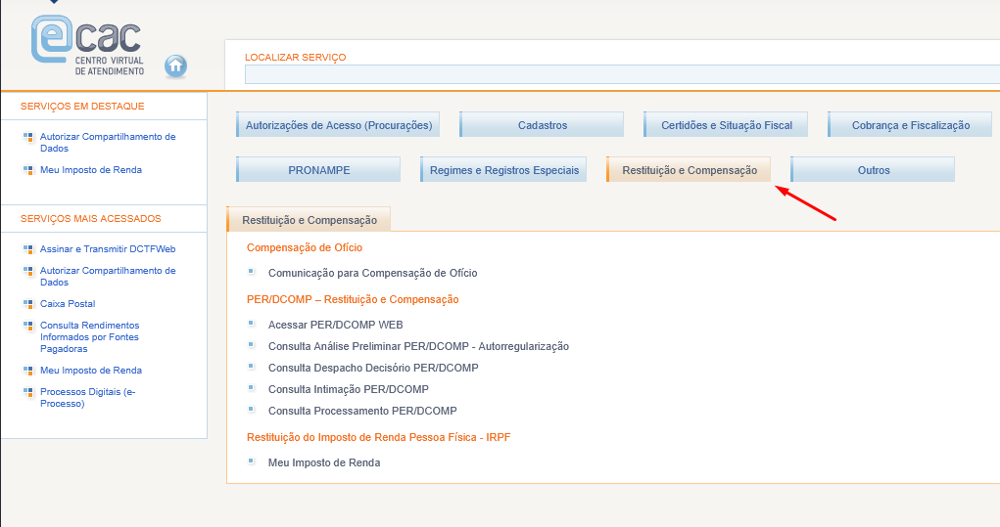
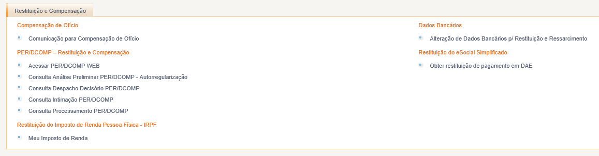

## Introdução

Os princípios gerais de projeto em IHC constituem um conjunto de diretrizes de alto nível que orientam a criação de sistemas cujo modelo conceitual seja facilmente assimilado pelo usuário. O objetivo central desses princípios é reduzir a discrepância entre os objetivos psicológicos das pessoas e os mecanismos físicos da interface, simplificando a travessia dos golfos de execução e avaliação. 

Ao aplicar fundamentos como a correspondência com as expectativas do usuário e o mapeamento natural, o designer assegura que a lógica do sistema seja transparente, previsível e alinhada à visão de mundo e ao idioma do seu público-alvo. 

A aplicação sistemática desses princípios envolve o equilíbrio entre controle e liberdade, a promoção da eficiência através de aceleradores e a visibilidade constante das ações e do estado atual do sistema. Além de padronizar a interação para reduzir a carga cognitiva, o design deve ser estruturado para prevenir falhas e oferecer mensagens claras que auxiliem na recuperação de erros de forma construtiva. Embora não substituam a pesquisa direta e o teste com usuários, esses princípios fornecem uma base teórica e prática sólida para decisões de design fundamentadas, garantindo que o produto apoie o desempenho humano de forma segura e intuitiva.

---

## Metodologia

Para este artefato os alunos separam os principios de projeto descritos no livro, assim cada aluno tem no mínimo um principio para avaliar no site, ele deve descrever como site executa esse principio, se executar, e se o executa de forma satisfatória. 

---

## Tabela de contribuição

| Autor | Análises realizadas | Data |
| :--- | :--- | :--- |
| [Heyttor Augusto](https://github.com/H3ytt0r62) | [Projeto para erros](#4-projeto-para-erros) | 11/05/2026 |
| [João Morais](https://github.com/Blazemorales) | [Antecipação e Eficiência](#5-antecipacao-e-eficiencia) | 11/05/2026 |
| [Lucas Gabriel](https://github.com/lucaszg-g) | [Correspondência com as expectativas](#2-correspondencia-com-as-expectativas) | - |
| [Rafael Melatti](https://github.com/Romm-0) | [Consistência e padronização](#3-consistencia-e-padronizacao) | 11/05/2026 |
| [Thiago Gomes](https://github.com/thgomxs) | [Visibilidade e reconhecimento](#1-visibilidade-e-reconhecimento) | 11/05/2026 |
| [Lucas Gabriel](https://github.com/lucaszg-g) | [Correspondência com as expectativas](#2-correspondência-com-as-expectativas) | 12/05/2026 |

---

### 1. Visibilidade e reconhecimento

O princípio de Visibilidade e Reconhecimento fundamenta-se na premissa de que a interface deve reduzir o esforço cognitivo do usuário, apresentando de forma clara as ações disponíveis e o estado atual do sistema. Segundo Norman (1988), o designer deve "tornar as coisas visíveis" com o objetivo direto de abreviar os golfos de execução e avaliação. Antes de realizar uma ação, o usuário precisa visualizar de forma imediata o que é possível fazer, e, após agir, a interface deve fornecer indicações do estado do sistema que sejam rapidamente percebidas e consistentes com o modelo mental do usuário.

A literatura destaca a importância de priorizar o **reconhecimento em vez da memorização**. O sistema não deve exigir que o usuário memorize comandos complexos ou lembre de informações de uma etapa anterior para utilizá-las em uma etapa futura da aplicação. Em suma, o estado do sistema, os objetos disponíveis, as opções de navegação e as instruções de uso devem estar sempre visíveis ou facilmente acessíveis.

Para assegurar uma boa visibilidade e reconhecimento, a interface deve:
* **Fornecer Feedback Contínuo:** Manter os usuários informados sobre o que está acontecendo através de um *feedback* adequado e em tempo hábil.
* **Indicar o Status:** O usuário não deve ter de procurar ou deduzir o estado do sistema; ele deve ser capaz de olhar rapidamente para a tela e obter uma primeira aproximação clara do status atual (Tognazzini, 2014).
* **Orientar a Navegação:** Manter o usuário informado sobre o caminho que percorreu no sistema. Sinalizações claras (como *breadcrumbs* ou menus destacados) orientam a interação e evitam que o usuário se perca, dispensando a necessidade de elaborar um mapa mental de onde ele está .

#### Análise de Visibilidade e Reconhecimento no e-CAC

Avaliando a interface do portal e-CAC sob a ótica da Visibilidade e do Reconhecimento, destacam-se os seguintes pontos de interação:

* **Feedback e Status do Sistema:** O sistema apresenta falhas graves na visibilidade do status. Como observado na avaliação de [Segurança](../metas_de_usabilidade/metas_de_usabilidade.md#2-seguranca), ações críticas como exclusão ou salvamento de dados sensíveis muitas vezes ocorrem sem mensagens de confirmação claras. Além disso, o sistema desloga o usuário por inatividade após 30 minutos sem exibir nenhum alerta prévio ou contagem regressiva na tela, causando perda repentina de dados. Como pode ser observado nas Figuras 1 e 2, ao clicar em um serviço da lista (Figura 1), o sistema imediatamente processa a solicitação e redireciona o usuário (Figura 2) sem apresentar nenhuma tela de confirmação prévia (ex: "Deseja realmente acessar o serviço X?") ou *feedback* visual de transição, o que frequentemente causa cliques acidentais e perda de controle.

    **Figura 1 - Seleção de serviço sem confirmação**

    

    Fonte: Elaborada pelos autores (2026).

    **Figura 2 - Processamento imediato do serviço sem feedback**

    

    Fonte: Elaborada pelos autores (2026).

* **Sinalização e Navegação:** A navegação carece de indicações claras de localização (*breadcrumbs*). Embora a aba ativa ganhe um leve destaque (uma borda laranja, conforme apontado no [Guia de Estilo](../guia_de_estilo/guia_de_estilo.md#12-janelas)), a quebra de fluxo constante imposta por redirecionamentos e a abertura de novos painéis em janelas/abas diferentes fazem com que o usuário perca o senso de onde está na arquitetura do site.

    **Figura 3 - Falta de breadcrumbs e destaque sutil da aba atual**

    

    Fonte: Elaborada pelos autores (2026).

* **Reconhecimento vs. Memorização:** O portal viola a premissa do reconhecimento ao utilizar extenso vocabulário técnico-contábil (ex: *DCTFWeb*, *PER/DCOMP Web*, *DARF*). Conforme levantado nas análises de [Brainstorming](../Brainstorming/Roteiro/Brainstorming.md) e do [Guia de Estilo](../guia_de_estilo/guia_de_estilo.md#2-elementos-de-acao), jargões e siglas forçam os usuários comuns a buscar significados em fontes externas e memorizá-los para uso futuro. Além disso, no painel de resultados, os links para serviços aparecem na cor cinza escuro, idênticos a um texto comum, não oferecendo o *affordance* visual clássico (azul/sublinhado) para que o usuário reconheça imediatamente a interatividade sem precisar passar o mouse sobre eles.

    **Figura 4 - Tela de Categoria Expandida com links na cor cinza e excesso de siglas**

    

    Fonte: Elaborada pelos autores (2026).

### 2. Correspondência com as expectativas

O princípio da Correspondência com as Expectativas estabelece que a interface deve utilizar conceitos, organização e formas de interação compatíveis com o modelo mental do usuário, aproveitando convenções e experiências já conhecidas para tornar a interação mais previsível e intuitiva (BARBOSA; SILVA, 2010, p. 265).

Esse princípio busca aproximar o funcionamento do sistema às expectativas naturais do usuário durante a navegação. Quando a plataforma apresenta respostas inesperadas, fluxos confusos ou comportamentos pouco previsíveis, ocorre uma quebra de expectativa que dificulta a utilização do sistema e aumenta a carga cognitiva necessária para executar tarefas simples.

#### Análise da Correspondência com as Expectativas no e-CAC

No e-CAC, observa-se que diversos fluxos de interação não seguem uma lógica facilmente previsível para usuários menos experientes. Em várias situações, o usuário precisa interpretar estruturas administrativas e organizacionais da Receita Federal para conseguir localizar funcionalidades específicas, ao invés de encontrar caminhos orientados às tarefas que deseja realizar.

Outro problema identificado está na fragmentação dos processos dentro da plataforma. Algumas funcionalidades exigem múltiplas etapas distribuídas em telas diferentes, dificultando ao usuário compreender claramente em qual etapa da tarefa ele se encontra. Isso reduz a previsibilidade da navegação e torna a interação menos intuitiva.

Além disso, determinados serviços apresentam descrições pouco objetivas, exigindo que o usuário interprete previamente qual funcionalidade corresponde à sua necessidade. Esse comportamento faz com que a plataforma dependa excessivamente do conhecimento prévio do cidadão sobre processos fiscais e tributários.

Também é possível perceber que a hierarquia visual das informações não corresponde, em muitos casos, às prioridades do usuário. Serviços frequentemente utilizados não recebem destaque proporcional, obrigando o usuário a percorrer diferentes categorias até localizar a funcionalidade desejada.

Dessa forma, conclui-se que o e-CAC apresenta limitações na Correspondência com as Expectativas por não estruturar sua navegação e organização de serviços de maneira suficientemente alinhada ao modelo mental do usuário comum.

---

### 3. Consistência e padronização

O e-CaC entrou em processo de migração para o gov.br e está operando em modelo híbrido com o portal antigo como site principal e algumas funcionalidades sendo redirecionadas para o portal novo. Isso fere esse princípio por redirecionar o usuário sem aviso prévio, como também a inconsistência com os padrões de cores e botões que são diferentes no site antigo e no novo. 

Outro problema que pode ser observado é a inconsistência na forma que o próprio site é referênciado. Ele é chamado de ECAC, E-cac, e-CaC e e-Cac dentro do próprio site. 

Além disso, existem muitas opções redundantes em diversos locais do site, como o acesso ao imposto de renda que pode ser encontrado em:
- Certidões e Situação Fiscal
- Declarações e Demonstrativos
- Pagamentos e Parcelamentos
- Restituição e Compensação

### 4. Projeto para erros

O E-cac não tem uma verificação final para processos sensiveis, correndo o risco do usuário cometer alguma modificação por engano e precisar fazer todo processo de modificação novamente, gerando frustação e gerando riscos ao usuário.

### 5. Antecipação e eficiência

De acordo com TOGNAZZINI (2014), um dos Princípios Gerais do Projeto envolve o quesito de **Antecipação** e **Eficiência**

TOGNAZZINI (2014)<a class="ref-link" data-img="../../../../images/GDP/image0.png" data-alt="Usabilidade">[ref.]</a>:  diz que **Antecipação** se refere a: "Prever as necessidades e desejos do usuário." Portanto, isso quer dizer que o sistema deve entregar todas os recursos necessários ao usuário antes que ele tenha que fazer isso por conta própria. 

- Podemos pensar, por analogia, a quando fazemos um pedido de um prato executivo para um garçom. O garçom pergunta qual o prato que o cliente deseja, quais acompanhamentos deseja, e se o cliente quer ou não bebida. O atendente deixa o cliente perdido, ele o direciona para concluir seu pedido. O mesmo acontece com os sistemas. Pensando em quando pesquisamos sobre uma loja física em um navegador, este apresenta ao usuário um aplicativo de navegação, caso o usuário queira chegar até a loja de carro, e mostra o horário de funcionamento do estabelecimento. Tudo isso ajuda a catalisar o processo, acelerá-lo.

Ainda segundo TOGNAZZINI (2014), temos o princípio da **Eficiência do usuário**. Nesse quesito, o autor trata da eficiência como "olhar para o produtvidade do usuário, e não da máquina" <a class="ref-link" data-img="../../../../images/GDP/image1.png" data-alt="Usabilidade">[ref.]</a>. Nesse caso, portanto, o objetivo está em facilitar o uso do usuário e tornar suas tarefas mais rápidas e precisas <a class="ref-link" data-img="../../../../images/GDP/image2.png" data-alt="Usabilidade">[ref.]</a>.

Para que isso aconteça, o autor enuncia os seguintes pontos para que a plataforma seja eficiente:

1. Mantenha o usuário ocupado<a class="ref-link" data-img="../../../../images/GDP/image3.png" data-alt="Usabilidade">[ref.]</a>.;
2. Para maximizar a eficiência de uma empresa, é preciso maximizar a eficiência de todos, não só dos desenvolvedores<a class="ref-link" data-img="../../../../images/GDP/image4.png" data-alt="Usabilidade">[ref.]</a>.;
3. As grandes barreiras de eficiência a serem superadas são encontradas na arquitetura do sistema, não na superfície do design da interface<a class="ref-link" data-img="../../../../images/GDP/image5.png" data-alt="Usabilidade">[ref.]</a>.;
4. Mensagem de erro devem ajudar o usuário<a class="ref-link" data-img="../../../../images/GDP/image6.png" data-alt="Usabilidade">[ref.]</a>.;

---

## Bibliografia

- Portal e-CaC, **Portal e-CaC**,https://www.gov.br/receitafederal/pt-br/canais_atendimento/atendimento-virtual, Acesso em: 11/05/2026
- Serviços do e-CaC, **GOV**,https://servicos.receita.fazenda.gov.br/Servicos/servicos-ecac/default.aspxl, Acesso em: 11/05/2026
- BARBOSA, S. D. J.; SILVA, B. S. da. **Interação humano-computador**. Rio de Janeiro: Elsevier, 2010.
- Migração do e-CaC, **GOV**, https://www.gov.br/receitafederal/pt-br/acesso-a-informacao/perguntas-frequentes/servicos-digitais/servicos-digitais/portal/o-e-cac-vai-acabar, Acesso em: 11/05/2026

---

## Referência Bibliográfica

- TOGNAZZINI, Bruce. First Principles of Interaction Design (Revised & Expanded). AskTog, 5 mar. 2014. Disponível em: https://asktog.com/atc/principles-of-interaction-design/. Acesso em: 11 maio 2026.

- BARBOSA, S. D. J.; SILVA, B. S. da. **Interação humano-computador**. Rio de Janeiro: Elsevier, 2010.
---

## Versionamento 

| Versão | Data | Descrição | Autor(es/as) | Revisor(es/as) |
| :--- | :--- | :--- | :--- | :--- |
| 1.0 | 11/05/2026 | Iniciação do documento | [Heyttor Augusto](https://github.com/H3ytt0r62) | - |
| 1.1 | 11/05/2026 | Documentação da [antecipação e eficiência](#5-antecipacao-e-eficiencia) | [João Morais](https://github.com/Blazemorales) | [Rafael Melatti](https://github.com/Romm-0) |
| 1.2 | 11/05/2026 | Documentação de [consistência e padronização](#3-consistencia-e-padronizacao) e correções | [Rafael Melatti](https://github.com/Romm-0) | - |
| 1.3 | 11/05/2026 | Documentação de [Visibilidade e reconhecimento](#1-visibilidade-e-reconhecimento) | [Thiago Gomes](https://github.com/thgomxs) | - |
| 1.4 | 11/05/2026 | Documentação de [Correspondência com as Expectativas](#2-correspondência-com-as-expectativas) | [Lucas Gabriel](https://github.com/lucaszg-g) | - |